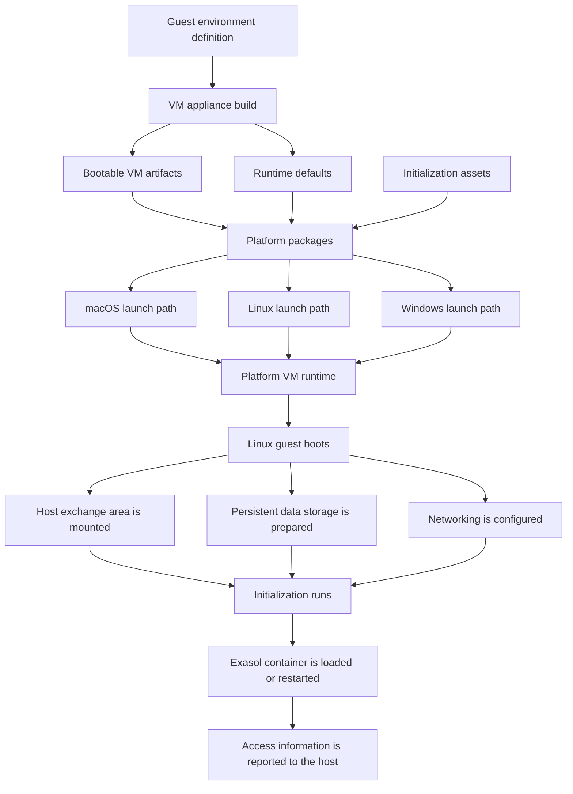
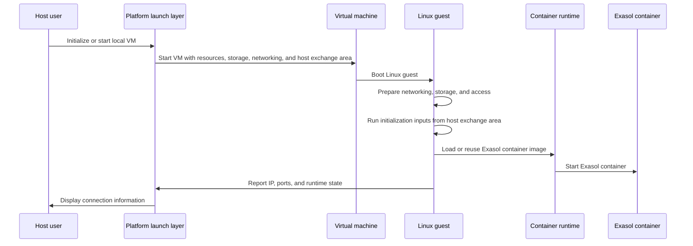
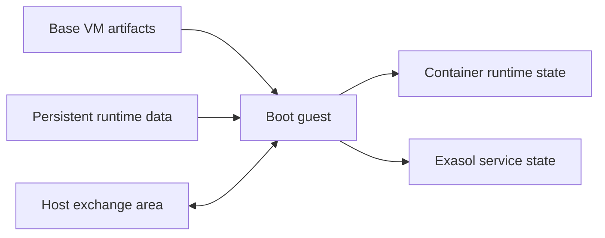

# Architecture

## Intent

The project provides a local Exasol runtime that behaves like a small VM
appliance. The user-facing goal is to make the Exasol container easy to start,
stop, initialize, and access on a developer machine without requiring users to
assemble the VM environment themselves.

The system is built around three ideas:

1. **A prepared Linux guest environment** that contains the operating-system
   pieces needed to run the Exasol workload.
2. **Platform-native VM startup** so the same conceptual appliance can run on
   different host platforms using their native virtualization stacks.
3. **A managed initialization flow** that connects host-provided assets,
   guest-side services, persistent data, networking, and user access into one
   repeatable lifecycle.

## Current Shape

At a bird's-eye view, the repository produces a VM appliance and wraps it in
platform-specific launch mechanisms.

The build output is not a general-purpose VM distribution. It is an appliance
image whose guest environment, initialization behavior, data layout, and access
patterns are designed around running one managed Exasol workload locally.

## Design Decisions

### VM appliance instead of direct host execution

The Exasol workload runs inside a Linux VM rather than directly on the host. This
keeps the host requirements small and avoids depending on a particular host
container runtime, filesystem layout, package manager, or Linux compatibility
layer.

The VM boundary gives the project one controlled place to define:

- the Linux runtime environment
- container runtime behavior
- SSH access
- data persistence
- network exposure
- startup and shutdown semantics

### Container inside a VM

The database payload is treated as a container workload inside the guest, while
the guest itself provides the stable operating environment. This separates two
concerns:

- the **VM appliance** defines the local runtime
- the **application container** defines the Exasol payload that runs inside it

The guest is intentionally centered on a single managed application container,
not on a multi-container orchestration model.

### Platform-specific launch, shared guest model

The same guest concept is used across platforms, but VM startup is delegated to
the host platform's virtualization mechanism.

Conceptually, each platform package is responsible for the same lifecycle:

1. locate or create the runtime state needed by the VM
2. start the VM with the configured CPU and memory resources
3. attach host-to-guest sharing where supported
4. expose guest services to the host
5. provide enough state for users and tools to connect
6. stop the VM in a way that allows guest data to flush cleanly

The implementation differs per platform because macOS, Windows, and Linux expose
different VM, networking, storage, and folder-sharing primitives.

### Explicit initialization flow

The VM does not assume that every runtime asset is permanently baked into the
base image. Instead, startup includes an explicit initialization phase that can
consume host-provided assets through a shared channel.

This phase is responsible for preparing the VM for use, including tasks such as:

- importing access credentials
- loading or refreshing the Exasol container payload
- preparing runtime directories
- discovering the guest network address
- reporting connection information back to the host

This keeps the base VM image reusable while still allowing each local instance to
be initialized with the assets and credentials created for that instance.

### Persistent data separated from startup assets

The architecture separates transient startup material from persistent runtime
state.

Startup material includes initialization assets, access configuration, and
payload transfer inputs. Persistent runtime state includes guest data, container
state, and database data that must survive VM restarts.

This separation allows the appliance to be re-initialized or upgraded without
treating all host-shared files as durable VM state.

### Host access through managed channels

The host interacts with the VM through a small set of managed channels:

- a shared folder or equivalent host-provided storage channel
- SSH for administrative access
- published or discoverable service ports for the Exasol workload
- logs and state files that describe how to connect to the running VM

The goal is that users do not need to inspect the guest console or know the
internal VM topology during normal operation.

## Build-Time Flow

The build process starts from a guest environment definition and produces VM
artifacts that can be consumed by platform runtimes.

At a high level, the build creates:

- a Linux guest filesystem with the required services and runtime tools
- bootable VM artifacts needed to start the guest
- packageable disk artifacts for platform launchers
- metadata that records the selected architecture and startup configuration

The resulting artifacts are then arranged into platform packages. Each package
contains the pieces needed by that platform to boot the same conceptual VM
appliance.

## Runtime Flow

Runtime begins when a user initializes or starts the local VM through the
platform entry point.

The expected lifecycle is:

The runtime flow is designed to be repeatable. If a VM restarts, existing runtime
state can be reused, while changed initialization inputs can be applied again.

## Storage Model

The architecture treats the bootable VM image and writable runtime data as
separate concerns.

The bootable image provides the operating environment. Runtime storage provides a
place for data that changes after boot, including container runtime state and
database state. The guest prepares this writable storage during startup and grows
or formats it when needed by the local instance.

Host-shared storage is a different channel. It is used to pass initialization
assets, credentials, logs, and optional user data between host and guest. It is
not the same thing as the guest's internal runtime storage.

Conceptually:

## Networking Model

The guest receives normal VM networking from the host platform. The platform
runtime then makes selected guest services available to the host.

The architecture distinguishes between:

- **guest networking**, which lets the VM configure an address and reach the
  network according to the host platform's VM model
- **host access**, which lets users connect to selected services from the host
  through forwarded ports, direct guest addressing, or platform-specific access
  information

SSH is used as the standard administrative entry point. The Exasol service is
exposed according to the runtime configuration for the platform.

## Packaging Model

Platform packages package the same appliance concept for different host
environments.

Each package answers the same questions for its platform:

- Which disk format does the platform need?
- How is the VM booted?
- How are CPU and memory configured?
- How does the guest receive host-provided assets?
- How are guest services made reachable from the host?
- How is VM state reported back to the user?

The packages differ because the host platforms differ, but they preserve the
same high-level lifecycle and guest behavior.

## Operational State

During operation, the system maintains state in three places:

1. **Host-side runtime state** for VM assets, generated credentials, logs, and
   connection information.
2. **Guest-side runtime state** for services, container runtime metadata, and
   database state.
3. **Shared exchange state** for initialization input and information that needs
   to cross the host/guest boundary.

Keeping these state categories distinct is important for predictable upgrades,
debugging, cleanup, and data persistence.

## Current Boundaries

The current architecture is intentionally narrow:

- it targets one managed Exasol workload per VM
- it does not provide a general container orchestration layer
- it does not require users to manage guest internals during normal operation
- it uses platform-specific VM startup instead of hiding every host difference
  behind one identical runtime implementation

These boundaries define the current state of affairs: a controlled local VM
appliance with platform-specific launchers and a shared guest lifecycle.
