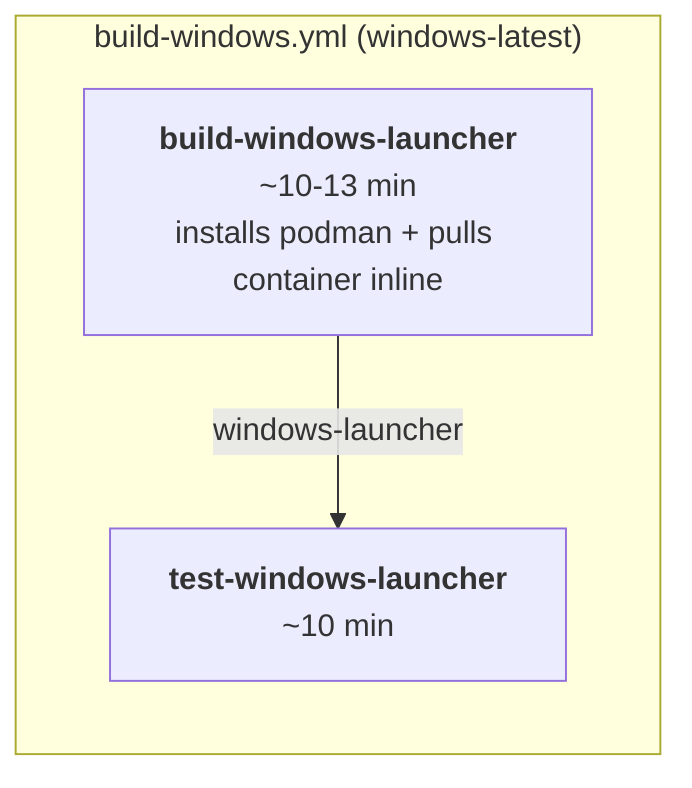

## How to build locally

Prerequisites on the developer machine:

- Go 1.25.0 (matches the [launcher/windows/go.mod](launcher/windows/go.mod)
  toolchain directive; the build cross-compiles to `GOOS=windows GOARCH=amd64
  CGO_ENABLED=0`, so any Linux or macOS host works — Windows works too but
  is not required).
- [Task](https://taskfile.dev/) (`task --version`).
- `tar`, `xz`, and `jq`. Linux gets these via `task install-deps`; macOS
  ships them via `brew install jq xz`.
- Podman (for the `download-db-container` step that pulls the Nano image).
  On Linux, `task install-deps` installs it. On macOS, `brew install
  podman` + `podman machine start` (the launcher build only needs
  `podman pull` + `podman save`, so a running machine is enough).

Two commands do everything:

```console
$ task build-windows-launcher IMG_ARCH=x86_64
```

The task chains through:

1. **`download-db-container IMG_ARCH=x86_64`** — `podman pull`s
   `docker.io/exasol/nano:${NANO_BASE_TAG}` for `linux/amd64` and saves it
   to `release/exasol-nano-db-x86_64.tar.gz` plus a `.metadata` sidecar.
   Cached: skipped on subsequent runs unless `NANO_BASE_TAG` changes.
2. **`stage-windows-init-assets IMG_ARCH=x86_64`** — copies the release
   tarball to `launcher/assets/windows/init/exasol-nano-db.tar.gz`.
   Cached: skipped on subsequent runs when the destination is newer than
   the source.
3. **`host/package/build-windows-launcher.sh x86_64`** — tars
   `launcher/assets/windows/init/` into
   `launcher/windows/init-assets.tar.xz` (the `//go:embed` target),
   runs `go mod tidy && go build -trimpath -ldflags="-s -w"`, writes
   `release/launcher/windows/x86_64/launcher.exe`, and removes the
   temporary tarball on exit.

To iterate on the launcher Go code without re-embedding the ~132 MB DB
tarball each time, use the unit-test task, which stages the embed once
and leaves it in place for subsequent iterative `go test`/`go build`
in `launcher/windows/`:

```console
$ task test-windows-launcher-unit IMG_ARCH=x86_64
$ cd launcher/windows && go test ./...   # fast, uses the staged embed
```

### Differences from the mac local build

| Concern | Mac (`task build-mac-launcher IMG_ARCH=aarch64`) | Windows (`task build-windows-launcher IMG_ARCH=x86_64`) |
|---|---|---|
| VM disk image build | Required (`task package-mac` runs the ~15-30 min disk-image pipeline via `host/build/build-artifacts.sh`, `host/package/package-mac.sh`) | Not required — no VM image is embedded. |
| CGO | Required (`github.com/Code-Hex/vz/v3` links against Apple's Virtualization.framework) | `CGO_ENABLED=0` — pure-Go build. |
| Host OS restriction | macOS only (needs `codesign`, Virtualization.framework headers) | Any OS with Go + tar + xz. Cross-compiles cleanly from Linux/macOS/Windows. |
| Embedded blobs (via `//go:embed`) | Two: `vm-package.tar.xz` (~hundreds of MB, the raw disk image) and `init-assets.tar.xz` (config + DB tarball + guest scripts). | One: `init-assets.tar.xz` (config + DB tarball, no guest scripts). |
| Local signing | Required by `build-mac-launcher.sh` — needs `MACOS_SIGN_KEYCHAIN` + `MACOS_SIGN_IDENTITY` env vars, and fails without them. | Not supported — the local build always produces an unsigned binary. Signing is CI-only via SSL.com eSigner (see "How to build in GitHub CI"). |

## How to build in GitHub CI

Two entry points:

- **`workflow_dispatch` of
  [.github/workflows/build-windows.yml](.github/workflows/build-windows.yml)**
  — produces artifacts, does not create a release. Trigger from the
  GitHub UI or with the developer helper
  `task ci-build-windows-launcher` (which pushes the branch first,
  triggers the workflow, watches it, and downloads the resulting
  `windows-launcher` artifact into `ci-downloads/`). Takes no flags:
  since Phase 15 the windows workflow is fully self-contained (no
  cross-workflow artifact dependency to reuse).
- **Tag push matching `v*`**
  ([.github/workflows/release.yml](.github/workflows/release.yml)) —
  calls `build-mac.yml` and `build-windows.yml` in parallel via
  `workflow_call`, then publishes a draft GitHub Release containing
  both `mac-runner-aarch64.zip` and `windows-runner-x86_64.zip`.

Job graph (post Phase 15):



Note: `build-mac.yml` and `build-windows.yml` are independent
workflows. Triggering the windows workflow does not run any mac jobs,
and vice versa. `release.yml` runs both in parallel.

What each windows job does:

1. **`build-windows-launcher` (windows-latest)** —
   - Sets up Go 1.25 with `cache-dependency-path: launcher/windows/go.sum`.
   - `choco install go-task -y`.
   - **Installs podman-for-windows on the fly** via
     `winget install --exact --id RedHat.Podman ...` (at machine scope
     since CI runs as admin; the launcher's own runtime install uses
     `--scope user` for non-admin end users). Adds
     `%ProgramFiles%\RedHat\Podman` to `$GITHUB_PATH`, initializes and
     starts a WSL2-backed podman machine with 40 GB disk.
   - Runs `task build-windows-launcher IMG_ARCH=x86_64`. Uses `bash`
     as the default shell (Git for Windows ships `bash + tar + xz +
     sha256sum`, so the same script the mac path uses works verbatim).
     The task chains `download-db-container` (which uses the podman
     machine installed above to `podman pull --platform linux/amd64`
     + `podman save` the x86_64 Nano image) → `stage-windows-init-assets`
     → the build script.
   - **Sign step** (skipped on PRs from forks — see below): invokes
     [`SSLcom/esigner-codesign@cf5f6c1d38ad10f47e3ed9aca873f429b1a8d85b`](https://github.com/SSLcom/esigner-codesign)
     (v1.3.2, pinned to SHA) which runs CodeSignTool against SSL.com's
     eSigner cloud HSM and overwrites `launcher.exe` in place with a
     signed copy. Uses the four `ESIGN_*` repository secrets.
   - **Verify step**: runs `signtool.exe verify /pa /v launcher.exe`
     against a dynamically-discovered `signtool.exe` under the Windows
     SDK install tree.
   - `Compress-Archive`s `release/launcher/windows/x86_64/*` into
     `dist/windows-runner-x86_64.zip`, computes `sha256sum` for the
     `.sha256` sidecar, and uploads both as the `windows-launcher`
     artifact.
2. **`test-windows-launcher` (windows-latest)** —
   - Installs podman-for-windows the same way `build-windows-launcher`
     did (windows-latest gives each job a fresh VM, so state does not
     carry over).
   - Downloads the `windows-launcher` artifact.
   - Runs `task test-launcher-integration` — the shared
     [tests/](tests/) suite auto-detects the host and picks up
     `dist/windows-runner-x86_64.zip`.
   - Uploads `tests/failures/` on any outcome as the
     `test-failure-logs-windows` artifact (distinct name from the mac
     workflow's `test-failure-logs` in case both workflows happen to
     be running for the same commit).

Signing gate for forks: both the sign and verify steps are guarded by
`if: env.ESIGN_USERNAME != ''` (with `ESIGN_USERNAME` promoted from
`secrets.ESIGN_USERNAME` at job level, since Actions rejects the
`secrets` context in `if:` expressions). Secrets aren't forwarded to
workflows dispatched from forks, so PRs from external contributors
produce a valid unsigned binary and don't fail on missing credentials.

### Differences from the mac CI build

| Concern | Mac ([build-mac.yml](.github/workflows/build-mac.yml)) | Windows ([build-windows.yml](.github/workflows/build-windows.yml)) |
|---|---|---|
| Workflow file | Contains `build-disk-images` (ubuntu), `build-mac-launcher` (macos), `test-mac-launcher` (self-hosted mac). Also stages the aarch64 Nano container tarball on ubuntu since macos-latest can't run `linux/amd64` podman. | Contains only `build-windows-launcher` and `test-windows-launcher`, both on windows-latest. Fully independent of `build-mac.yml`. |
| Cross-workflow deps | None. | None (since Phase 15). |
| Test-job runner | Self-hosted mac ARM64 with the `virtualization` label — Apple silicon is not available on GitHub-hosted runners, and mac tests need `vz` for the guest VM. | GitHub-hosted `windows-latest`. Podman-for-windows is installed on the fly (~2–3 min) via `winget install RedHat.Podman` + `podman machine init/start`. See Phase 13. |
| Container tarball staging | Done in `build-disk-images` on ubuntu via `task download-db-container IMG_ARCH=aarch64` (podman-for-linux is cheap). Uploaded in the `release-packages` artifact. | Done in `build-windows-launcher` on windows-latest via the same task after installing podman + WSL2 inline. Never uploaded as a separate artifact — flows straight into the launcher binary via `//go:embed`. |
| Container runtime at runtime | Podman is baked into the mac launcher's embedded VM disk image (the guest OS runs it). CI does not touch podman on the mac runner. | Podman-for-windows runs on the host (via a WSL2-backed machine). CI installs it fresh per job. |
| Signing service | Apple `codesign` + `xcrun notarytool submit --wait`. Uses the six `IOS_*` secrets. Signing runs on the macos-latest builder as part of `build-mac-launcher`. | SSL.com eSigner via the [`SSLcom/esigner-codesign`](https://github.com/SSLcom/esigner-codesign) action. Uses the four `ESIGN_*` secrets. Private key never leaves SSL.com's HSM. No separate notarization step. |
| Signing composite action | Custom [`.github/actions/setup-macos-signing`](.github/actions/setup-macos-signing/action.yml) unpacks the PKCS#12 into the runner's keychain. | None. The first-party SSLcom action encapsulates CodeSignTool install, TOTP generation, and the HSM round-trip; a local wrapper would add nothing. |
| Packaging | `ditto -c -k .` → `dist/mac-runner-aarch64.zip`; `shasum -a 256` → `.sha256`. | PowerShell `Compress-Archive` → `dist/windows-runner-x86_64.zip`; `sha256sum` (Git for Windows) → `.sha256`. Byte-identical `.sha256` shape. |
| Release integration | `create-release` job in `release.yml` downloads `mac-launcher` and uploads its files. | Same job also downloads `windows-launcher` into `release-artifacts/windows/`. `release.yml`'s `build-mac` and `build-windows` jobs run in parallel. A tag push publishes both binaries in one draft release. |
| Test-failure artifact name | `test-failure-logs` (path: `tests/failures`). | `test-failure-logs-windows` — distinct to avoid upload-artifact collisions across workflows for the same commit. |
| Developer helper | `task ci-build-mac-launcher` → `host/github/ci-build-mac-launcher.sh`. `--skip-linux-build` avoids the ~15 min mac disk image build by reusing `release-packages` from a prior run. | `task ci-build-windows-launcher` → `host/github/ci-build-windows-launcher.sh`. Takes no flags — the workflow is self-contained. Downloads the `windows-launcher` artifact and, on failure, the `test-failure-logs-windows` artifact. |