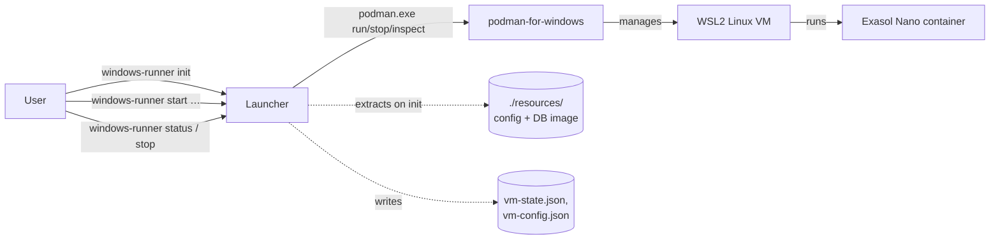
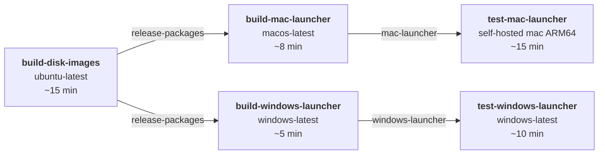

We are creating a windows equivalent of the mac vm launcher in `launcher/mac/main.go`

This is a CLI tool. The windows version must support the exact same subcommands with the exact same args.

Unlike the mac version, which uses a virtual machine to run a podman container, the windows version must used the natively installed podman-for-windows installation.

Tests that run on the mac version should also pass on the windows version.

# Background

## Required sub commands

The mac launcher (`launcher/mac/main.go`) exposes the following subcommands
via a single `flag`-based dispatcher in `main()`. The windows version must
support the same set with matching flags, positional arguments, exit codes,
and stdout/stderr contracts so the shared integration tests in `tests/` keep
passing.

- `init [--ssh-key <private-key>]`
  - Prepares the working directory for a first-time launch.
  - Without `--ssh-key`, generates a new ED25519 SSH keypair (private key at
    `vm-ssh-key`, public key at `vm-shared/authorized_keys`).
  - With `--ssh-key <path>`, adopts the provided private key: derives the
    public key from it, writes `vm-shared/authorized_keys`, and records the
    key path in `vm-config.json` (see `RuntimeConfig`).
  - On mac it also extracts the embedded VM tarball (`vm-package.tar.xz`)
    into `./vm/` and the embedded init assets (`init-assets.tar.xz`) into
    `./vm-shared/`. On windows there is no VM tarball, but the init assets
    (or an equivalent set of container-runtime bootstrap files) still need
    to be materialized into `./vm-shared/` so that the same guest-side
    scripts run.
- `start [--ports <svc>:<port>,...] [--version-check-* flags] <cpu> <ram_mb> <data_size_gb>`
  - Positional args: CPU count, RAM in MB, data disk size in GB (positive
    integer).
  - `--ports` overrides host-side port bindings for named services (for
    example `--ports db:9090,ssh:2222`). Unspecified services default to the
    guest port and fall back to a random free port if that host port is
    unavailable.
  - `--version-check-enabled`, `--version-check-interval-seconds`,
    `--version-check-identity`, `--version-check-url` configure the periodic
    version-check that the guest performs; the flag values are serialized as
    `vm-shared/version-check.json` (`VersionCheckRuntimeConfig`).
  - Handles the data disk lifecycle (create sparse / reuse / grow / reject
    shrink). On windows the equivalent step will size/attach the podman
    volume or VHD rather than a raw `data.img`.
  - Spawns a background daemon that keeps the VM/container running until
    `stop` is called and writes runtime state (chosen ports, PID, IP) so
    other subcommands can find it.
- `__daemon__ <cpu> <ram> [ports]` (mac-internal)
  - Internal re-exec entry point used by `start` to run the vz-backed VM in
    the background. The windows version does not need an identical
    `__daemon__` subcommand, but the equivalent detached podman lifecycle
    must be reachable through `start`/`stop` in the same way.
- `stop`
  - Requests a graceful shutdown of the running VM (waits up to 30s), then
    forces stop if needed. Removes any transient runtime state files.
- `status`
  - Prints a single JSON object `{"running": bool}` on stdout. Used by the
    integration tests to poll VM state.
- `resize-data <size_gb>`
  - Resizes the data disk to the requested size in GB. VM must be stopped.
    Growing is allowed; shrinking is rejected. The windows implementation
    will target its podman volume / VHD instead of the raw disk image.

Exit code conventions to preserve on windows:

- `0` on success.
- `1` for runtime errors (also used for missing usage args in a few
  legacy branches).
- `2` for flag-parse errors and wrong positional argument counts.

## Build proceedure

The existing build proceedure for the mac version is managed in the
`Taskfile.yml` with the following steps. All tasks are parameterized by
`IMG_ARCH` (`aarch64` or `x86_64`); the released macOS build uses
`aarch64`.

1. `download-db-container IMG_ARCH=<arch>` — runs
   [launcher/assets/download-db-container.sh](launcher/assets/download-db-container.sh),
   which `podman pull`s `docker.io/exasol/nano:${NANO_BASE_TAG}` for the
   requested platform, verifies the entrypoint is `/controller`, saves the
   image with `podman save | gzip -9` to
   `release/exasol-nano-db-<arch>.tar.gz` and writes a sibling `.metadata`
   file. Cached by task status checks so it is only re-run when
   `NANO_BASE_TAG` or the script changes.
2. `stage-init-assets IMG_ARCH=<arch>` — runs
   [launcher/assets/stage-init-assets.sh](launcher/assets/stage-init-assets.sh),
   which reads `db.tarball_name` from
   [launcher/assets/init/config.json](launcher/assets/init/config.json) and
   copies the pulled tarball into
   `launcher/assets/init/exasol-nano-db.tar.gz` so it can be embedded
   alongside the init scripts.
3. `build IMG_ARCH=<arch>` — runs `host/build/build-artifacts.sh`, which
   produces kernel/initramfs/raw disk artifacts under `output/<arch>/`.
   Only needed for mac (embedded VM image) — the windows launcher skips
   this entirely.
4. `package-mac IMG_ARCH=aarch64` — runs
   [host/package/package-mac.sh](host/package/package-mac.sh), which
   copies `output/aarch64/disk.img` into `package/mac-arm64/`, then
   `tar | xz -9 --extreme`s the directory into
   `release/mac-arm64.tar.xz`. This archive is what gets embedded as
   `vm-package.tar.xz`.
5. `build-mac-launcher IMG_ARCH=<arch>` — runs
   [host/package/build-mac-launcher.sh](host/package/build-mac-launcher.sh),
   which:
   - Copies `release/mac-<arch>.tar.xz` to `launcher/mac/vm-package.tar.xz`.
   - `tar | xz -9 --extreme`s `launcher/assets/init/` into
     `launcher/mac/init-assets.tar.xz`.
   - Runs `go mod tidy && go mod download && go build` with
     `-trimpath -ldflags="-s -w"` targeting `GOOS=darwin GOARCH=<arm64|amd64>`,
     writing the binary to `release/launcher/darwin/<arch>/launcher`.
   - Removes the temporary `vm-package.tar.xz` and `init-assets.tar.xz`.
   - Signs the resulting binary with `codesign` using
     `entitlements.plist` (requires `MACOS_SIGN_KEYCHAIN` and
     `MACOS_SIGN_IDENTITY`) and verifies the
     `com.apple.security.virtualization` entitlement is present. CGO is
     required because `github.com/Code-Hex/vz/v3` binds Apple's
     Virtualization.framework, so `CGO_ENABLED=0` is not an option on mac.

The mac launcher therefore embeds **two** things via `go:embed`:

- `vm-package.tar.xz` — the UEFI raw disk image plus supporting artifacts
  produced by the disk-image build pipeline. The windows launcher will
  **not** embed anything analogous; it delegates VM/container execution to
  the natively installed podman-for-windows and is decoupled from the disk
  image pipeline in this repo.
- `init-assets.tar.xz` — the `launcher/assets/init/` directory tree,
  including `init.sh`, `init-db.sh`, `init-ip.sh`, `init-ssh.sh`,
  `init-db-test.sh`, `config.json`, `init-output.json.template`, and the
  staged `exasol-nano-db.tar.gz` database container image. Confirmed: the
  Exasol database container image is embedded inside the launcher binary
  (via the init assets tarball, not as a separate embed). The windows
  launcher will need the same database container available to
  podman-for-windows; whether it re-embeds the tarball or pulls it at
  runtime is an open design choice for the windows implementation.

## Github CI

The mac launcher has the following CI workflows under `.github/workflows/`:

- [lint.yml](.github/workflows/lint.yml) — runs on `pull_request` and
  pushes to `main`. Currently only checks copyright/SPDX headers via
  `tools/copyright_headers.py --check`. No mac-specific steps.
- [build-packages.yml](.github/workflows/build-packages.yml) — triggered
  via `workflow_dispatch` and `workflow_call`. Three jobs:
  1. `build-disk-images` (ubuntu-latest) — installs `task`, runs
     `task install-deps`, logs in to GHCR for the podman build cache,
     then runs `task package-mac IMG_ARCH=aarch64` and
     `task download-db-container IMG_ARCH=aarch64`, and uploads
     `release/` (containing `mac-arm64.tar.xz`,
     `exasol-nano-db-aarch64.tar.gz`, and its `.metadata`) as the
     `release-packages` artifact. Can be skipped via the
     `skip-linux-build` input to reuse a prior run's artifact — useful
     when only the launcher Go code changes.
  2. `build-mac-launcher` (macos-latest, needs `build-disk-images`) —
     downloads the `release-packages` artifact (either from the current
     run or, when `skip-linux-build` is set, from the latest successful
     historical run on the same branch), sets up Go 1.22 with
     `launcher/mac/go.sum` cache key, installs `task` via Homebrew,
     configures the signing keychain via
     [.github/actions/setup-macos-signing](.github/actions/setup-macos-signing/action.yml),
     runs `task build-mac-launcher IMG_ARCH=aarch64`, `ditto`-zips the
     `release/launcher/darwin/aarch64/` directory into
     `dist/mac-runner-aarch64.zip`, notarizes with `xcrun notarytool
     submit --wait` using App Store Connect API credentials, and uploads
     the notarized zip plus its `.sha256` as the `mac-launcher` artifact.
  3. `test-mac-launcher` (self-hosted mac ARM64 with virtualization,
     needs `build-mac-launcher`) — downloads the `mac-launcher`
     artifact, installs `task`, and runs `task
     test-launcher-integration` (which executes `go test -timeout 30m
     ./...` under `tests/`). Uploads `tests/failures/` on any outcome.
- [release.yml](.github/workflows/release.yml) — triggered on `v*` tag
  push. Validates the tag with a `vMAJOR.MINOR.PATCH[-pre]` regex,
  re-uses `build-packages.yml` via `workflow_call`, then downloads the
  `mac-launcher` artifact and publishes a GitHub Release (draft →
  publish), marking it as prerelease when the tag has a pre-release
  suffix.
- [ci-build-mac-launcher.sh](host/github/ci-build-mac-launcher.sh)
  (invoked via the `ci-build-mac-launcher` task) — helper for
  developers to trigger the workflow from a local checkout and download
  the resulting launcher artifact, with an option to skip the Linux
  disk-image build for launcher-only iterations.

## Additional useful background information

- Directory layout at runtime (relative to the launcher's working dir):
  `vm/` holds the extracted VM image (mac only); `vm-shared/` is the
  host↔guest exchange folder that becomes `/mnt/host` inside the guest and
  contains `authorized_keys`, `version-check.json`, `vm-init-output.json`,
  and a `logs/` subdir; `vm-ssh-key` (or the user-provided key) is the SSH
  private key; `vm-config.json` (`RuntimeConfig`) records the SSH key path
  and other launcher state. The integration tests in `tests/` assume this
  layout.
- Guest bootstrap contract: after boot, `launcher/assets/init/init.sh`
  drives `init-ip.sh`, `init-ssh.sh`, `init-db.sh`, and `init-db-test.sh`,
  and writes `vm-shared/vm-init-output.json` following
  `init-output.json.template` (JSON with `ip` and `ports`). The launcher
  parses this via the `InitOutput` struct in `main.go` to learn the
  guest-side IP and negotiated ports.
- Integration tests: [tests/](tests/) is a standalone Go module
  (`tests/go.mod`) with fixture-based tests
  ([fixture_test.go](tests/fixture_test.go)) covering data persistence,
  DB connectivity, port overrides, SSH, and status. These are the tests
  that must also pass on windows; they invoke the launcher binary and
  parse its stdout/stderr.
- Go module: [launcher/mac/go.mod](launcher/mac/go.mod) targets Go 1.25.0
  and depends on `github.com/Code-Hex/vz/v3` (mac-only, CGO),
  `github.com/ulikunitz/xz` (pure-Go), and `golang.org/x/crypto`. The
  windows launcher already has its own module at
  [launcher/windows/go.mod](launcher/windows/main.go) — it will need to
  drop the vz dependency and instead shell out to `podman.exe` (and
  possibly the podman-for-windows machine tooling).
- Podman-for-windows detail: the natively installed podman-for-windows
  ships its own WSL2-backed Linux VM under the hood, so the windows
  launcher effectively delegates the "VM" concern to podman and only
  needs to manage the container lifecycle, port publishing, volume for
  persistent data, and copying the init/SSH assets into the container.
- Copyright header lint: every source file in this repo is expected to
  carry the `// Copyright 2026 Exasol AG` / `SPDX-License-Identifier: MIT`
  header enforced by `tools/copyright_headers.py`. New windows launcher
  files must include the same header.


# Pre-work refactor

The current `launcher/assets` folder needs to be moved to `launcher/assets/mac`,
so the windows-specific assets can live cleanly under
`launcher/assets/windows` without name collisions. The move also requires
updating:

- [host/package/build-mac-launcher.sh](host/package/build-mac-launcher.sh) —
  change the `tar -C "$ROOT_DIR/launcher/assets" -cf - init` line to
  `tar -C "$ROOT_DIR/launcher/assets/mac" -cf - init`.
- [launcher/assets/stage-init-assets.sh](launcher/assets/stage-init-assets.sh)
  → [launcher/assets/mac/stage-init-assets.sh](launcher/assets/mac/stage-init-assets.sh);
  update its `DEST_TARBALL` path and the `CONFIG_FILE` path.
- [launcher/assets/download-db-container.sh](launcher/assets/download-db-container.sh)
  → [launcher/assets/mac/download-db-container.sh](launcher/assets/mac/download-db-container.sh)
  (or lifted to a shared location if we want to reuse it for windows — see
  "Differences with the mac version" below).
- [Taskfile.yml](Taskfile.yml) — update all `./launcher/assets/...` paths in
  the `download-db-container`, `stage-init-assets`, and status checks.

Alternative: keep the current `launcher/assets/{init,download-db-container.sh,stage-init-assets.sh}`
layout, and only add a new sibling `launcher/assets/windows/` for
windows-specific files. This avoids touching the mac build path and only
requires new tasks. Recommendation: the alternative — because
`download-db-container.sh` and its output (the `exasol-nano-db-<arch>.tar.gz`
tarball) is genuinely shared between platforms, and moving it under `mac/`
would misrepresent its scope. (NOTE: Okay, do this)

# Windows version

## Required sub commands

The windows launcher will be in `launcher/windows/main.go` and exposes the
following subcommands via a single `flag`-based dispatcher in `main()`.
The windows version must support the same set with matching flags
positional arguments, exit codes, and stdout/stderr contracts, because other projects outside of this codebase depend on the interface remaining stable, and so the
shared integration tests in [tests/](tests/) can be reused (the tests
currently have `//go:build darwin`; that constraint will be dropped or
replaced with `darwin || windows` and any mac-only assertions guarded).

- `init [--ssh-key <private-key>]`
  - Prepares the working directory for a first-time launch.
  - Extracts the embedded `init-assets.tar.xz` (see
    [Build procedure](#build-proceedure-1)) into `./resources/` — this
    contains at minimum `config.json` and `exasol-nano-db.tar.gz`. `./resources/`
    is the windows analogue of the mac `./vm-shared/` + `./vm/` split (there
    is no guest VM to sync with, so we do not need a `vm-shared/` folder).
  - `--ssh-key` handling: reject the flag with a clear error message
    (exit code 2) rather than silently accepting it. Recommended message:
    `"--ssh-key is not supported on windows: there is no guest VM to SSH into"`.
    Silently accepting the flag would mislead users who copy mac invocations
    verbatim, and the two SSH-related integration tests
    (`TestSSHKeyGeneration` and `TestSSHConnectivityAfterStart` in
    [tests/ssh_test.go](tests/ssh_test.go)) will be excluded from the
    windows run anyway. Alternative if strict compatibility is required:
    accept and ignore the flag, print a stderr warning, and emit an empty
    `vm-ssh-key` marker file so downstream tooling detects "no SSH".
  - Writes a `vm-config.json` (`RuntimeConfig`) even on windows so `stop`
    and `status` share the same on-disk contract as mac; on windows the
    `ssh_private_key` field is left empty.
- `start [--ports <svc>:<port>,...] [--version-check-* flags] <cpu> <ram_mb> <data_size_gb>`
  - Positional args (`cpu`, `ram_mb`, `data_size_gb`) are **parsed and
    validated** for compatibility but otherwise ignored, because
    podman-for-windows sizes its own WSL2 backing VM globally via
    `podman machine set`. Keeping the args required (rejecting missing or
    non-integer values with exit code 2) preserves the CLI contract and
    lets us surface the values in `--help` and logs without silently
    diverging from the mac behavior.
  - `--ports` overrides host-side port bindings. Windows uses native
    podman `-p <host_port>:<container_port>` publishing. To match the mac
    "unspecified services default to the guest port; fall back to a
    random free port if unavailable" behavior, the launcher must probe
    each requested host port with a `net.Listen("tcp", ":<port>")` (and
    immediately close) *before* invoking `podman run`, and fall back to
    `":0"` to obtain a free port. `TestPortOverrideFailsIfPortInUse` in
    [tests/ports_test.go](tests/ports_test.go) requires an explicit
    override to a busy port to be a hard failure (exit code 1) — do
    **not** silently fall back in that case.
  - `--version-check-*` flags: on mac these are serialized to
    `vm-shared/version-check.json` and consumed by
    [launcher/assets/init/init-db.sh](launcher/assets/init/init-db.sh)
    which then translates them into `podman run … init
    VERSION_CHECK_ENABLED=… VERSION_CHECK_ENDPOINT=…` args passed to the
    Nano container. On windows, the launcher takes on the role that
    `init-db.sh` plays on mac: it must translate the same flag values
    directly into the `podman run` argv (see the guest-side script for
    the exact key names).
  - Data disk lifecycle: podman does not use a raw `data.img`. Use a
    **named podman volume** (e.g. `exasol-nano-data`) mounted at `/exa`
    inside the container, matching the guest-side
    `-v "$EXA_DATA_DIR:/exa"` pattern in
    [init-db.sh](launcher/assets/init/init-db.sh#L403). Named volumes
    persist across `podman rm` and are the idiomatic podman-for-windows
    approach; a VHD would only be relevant if we needed a fixed-size
    block device, which the Exasol Nano image does not require (`/exa`
    is a normal filesystem path). See the "Differences with the mac
    version" section for how to reconcile this with `data_size_gb` and
    `resize-data`.
  - **No background daemon is needed**: unlike the mac version, which
    must re-exec itself as `__daemon__` to keep the vz-backed VM alive,
    `podman run -d` already detaches the container into the podman
    service. The launcher simply invokes `podman run -d …` and returns.
    (The prior draft said "a background daemon … is now needed" — that
    was a typo; it is the opposite.) State that the mac daemon wrote
    (e.g. `vm-state.json` with `Ports` and `PID`) still needs to be
    written by the windows `start` command directly, because the tests
    read `vm-state.json` to discover chosen ports.
- `stop`
  - Runs `podman stop --time 30 <container>` (30s graceful window),
    followed by `podman rm <container>` to remove the stopped container
    so a subsequent `start` can recreate it. Removes `vm-state.json` and
    any other transient runtime state files. Idempotent — no error if
    the container is already stopped/gone. The named data volume is
    **preserved** so `TestDataPersistenceAcrossRestart` passes.
- `status`
  - Prints `{"running": true}` if `podman inspect --format '{{.State.Running}}'
    <container>` returns `true`, otherwise `{"running": false}`.
    Exits 0 in both cases. `TestStatusAfterForcefulKill` in
    [tests/status_test.go](tests/status_test.go) exercises the case
    where the launcher process is killed but the container might still
    be running — on windows this is naturally correct because podman is
    the source of truth, not any launcher-owned process.
- `resize-data <size_gb>`
  - See "Differences with the mac version" for the recommended handling
    of `TestDataDiskGrowth` and `TestDataDiskShrinkRejected`. Short
    version: record the requested size in a sidecar file
    (`resources/data-size.txt`), enforce the "grow-only, no shrink" rule
    against the recorded value, and have `start` reject a smaller
    `data_size_gb` too. This preserves the test contract without
    actually resizing anything (podman-for-windows sizes its WSL disk
    globally, not per-volume).

Exit code conventions to preserve on windows:

- `0` on success.
- `1` for runtime errors (also used for missing usage args in a few
  legacy branches).
- `2` for flag-parse errors and wrong positional argument counts.

## Build proceedure

The existing build proceedure for the mac version is managed in the
`Taskfile.yml` with the following steps. All tasks are parameterized by
`IMG_ARCH` (`aarch64` or `x86_64`); the released windows build uses
`x86_64` (podman-for-windows ARM64 exists but is not a common
deployment target).

1. `download-db-container IMG_ARCH=x86_64` — runs the existing
   [launcher/assets/download-db-container.sh](launcher/assets/download-db-container.sh)
   (see "Pre-work refactor" — recommended to keep it in place and share
   with mac). Produces `release/exasol-nano-db-x86_64.tar.gz` and its
   `.metadata` sibling.
2. `stage-windows-init-assets IMG_ARCH=x86_64` — new sibling of
   `stage-init-assets`. Reads `db.tarball_name` from
   `launcher/assets/windows/init/config.json` and copies
   `release/exasol-nano-db-x86_64.tar.gz` to
   `launcher/assets/windows/init/exasol-nano-db.tar.gz` so it can be
   embedded.
3. `build-windows-launcher IMG_ARCH=x86_64` — runs
   `host/package/build-windows-launcher.sh`, which:
   - `tar | xz -9 --extreme`s `launcher/assets/windows/init/` into
     `launcher/windows/init-assets.tar.xz`.
   - Runs `go mod tidy && go mod download && go build` with
     `-trimpath -ldflags="-s -w"` and `CGO_ENABLED=0` (nothing on windows
     needs CGO — no vz equivalent) targeting `GOOS=windows GOARCH=amd64`,
     writing the binary to `release/launcher/windows/x86_64/launcher.exe`.
   - Removes the temporary `init-assets.tar.xz`.
   - Signs the binary with `signtool.exe sign` using a code-signing
     certificate. See "Windows code signing" below.

The windows launcher therefore embeds **one** thing via `go:embed`:

- `init-assets.tar.xz` — the `launcher/assets/windows/init/` directory
  tree, including `config.json` and the staged `exasol-nano-db.tar.gz`
  database container image.

### Windows code signing

The mac launcher is signed with Apple's `codesign` and notarized via
`notarytool`. The windows equivalent is Authenticode signing.

**Signing infrastructure is already provisioned by IT.** This
repository already carries four secrets that map onto SSL.com's
[eSigner cloud code-signing](https://www.ssl.com/how-to/esigner-cloud-code-signing-with-codesigntool-command-line-guide/)
service:

- `ESIGN_USERNAME` — SSL.com account username
- `ESIGN_PASSWORD` — SSL.com account password
- `ESIGN_CREDENTIAL_ID` — id of the signing credential in SSL.com's HSM
- `ESIGN_TOTP_SECRET` — shared secret from which the TOTP 2FA code is
  generated at sign time

With eSigner the private key never leaves SSL.com's HSM; the local
signer (CodeSignTool, a Java CLI) authenticates over TLS, uploads the
executable, and receives the signed binary back. No PFX file, no local
key material, no HSM device to manage.

Concretely for Phase 12:

- Use the first-party GitHub Action
  [`SSLcom/esigner-codesign`](https://github.com/SSLcom/esigner-codesign),
  which vendors CodeSignTool and exposes the four secrets as inputs.
  Pin to a commit SHA per this repo's convention for third-party
  actions.
- Timestamping is handled by CodeSignTool internally (it uses SSL.com's
  RFC 3161 timestamp server by default); no timestamp URL secret is
  needed.
- Signature verification uses `signtool.exe verify /pa /v launcher.exe`
  as a follow-up step — `signtool.exe` is preinstalled with the Windows
  SDK on GitHub-hosted `windows-latest` runners.
- The certificate SSL.com issues via eSigner is trusted by SmartScreen
  once it accumulates reputation; no separate notarization step is
  required on Windows.

The prior draft of this subsection assumed a PFX-based signing model
with new secrets (`WINDOWS_SIGN_PFX_BASE64`, `WINDOWS_SIGN_PFX_PASSWORD`).
That model is superseded — IT has already provisioned eSigner, so
Phase 12 uses the existing `ESIGN_*` secrets and no new secret
provisioning is required.

## Github CI

The mac launcher has the following CI workflows under `.github/workflows/`.
The windows version adds two jobs and reuses the shared release flow.

- [lint.yml](.github/workflows/lint.yml) — runs on `pull_request` and
  pushes to `main`. Checks copyright/SPDX headers via
  `tools/copyright_headers.py --check`. No changes needed for windows —
  the new `launcher/windows/*.go` and `launcher/assets/windows/**` files
  will be picked up automatically as long as they carry the standard
  header.
- [build-packages.yml](.github/workflows/build-packages.yml) — add two
  new jobs alongside `build-disk-images`, `build-mac-launcher`,
  `test-mac-launcher`:
  1. `build-windows-launcher` (`runs-on: windows-latest`, `needs:
     build-disk-images`) — downloads the `release-packages` artifact
     produced by `build-disk-images` (same as the mac job; the artifact
     already contains `exasol-nano-db-x86_64.tar.gz` if we add
     `task download-db-container IMG_ARCH=x86_64` to the
     `build-disk-images` step). Sets up Go with
     `cache-dependency-path: launcher/windows/go.sum`, installs `task`
     (`choco install go-task` or `winget install Task.Task`), stages the
     windows init assets, runs `task build-windows-launcher
     IMG_ARCH=x86_64`, then packages the launcher as
     `dist/windows-runner-x86_64.zip` and its `.sha256` sibling using
     PowerShell `Compress-Archive` (the mac job uses `ditto` — same
     effect, different tool). If a signing certificate is configured,
     decodes `WINDOWS_SIGN_PFX_BASE64` to a temp `.pfx` and invokes
     `signtool.exe sign` (see "Windows code signing" above). Uploads
     the artifact as `windows-launcher`.

     Note: there is **no** existing `.github/actions/setup-windows-signing`
     composite action; one will need to be authored (analogous to
     [.github/actions/setup-macos-signing](.github/actions/setup-macos-signing/action.yml))
     that decodes the base64 PFX to a runner-temp file and exports
     `WINDOWS_SIGN_PFX_PATH` and `WINDOWS_SIGN_PFX_PASSWORD` for the
     build step to consume. Delete this note once the action exists.
  2. `test-windows-launcher` (`runs-on: [self-hosted, Windows, X64,
     podman]`, `needs: build-windows-launcher`) — downloads the
     `windows-launcher` artifact, ensures podman-for-windows is
     installed and its machine is running (`podman machine start` if
     needed), installs `task` and Go, and runs `task
     test-launcher-integration` (which executes `go test -timeout 30m
     ./...` under `tests/`). Uploads `tests/failures/` on any outcome.
     This job requires a self-hosted runner because the GitHub-hosted
     `windows-latest` runners do not have podman-for-windows preinstalled
     and enabling nested virtualization on them is not reliable.

     `build-disk-images` should also start running `task
     download-db-container IMG_ARCH=x86_64` so the windows job has a
     tarball to embed. Verify the release-artifacts checks in the
     workflow ("Verify release artifacts" step) are updated to require
     the new file.
- [release.yml](.github/workflows/release.yml) — triggered on `v*` tag
  push. Validates the tag with a `vMAJOR.MINOR.PATCH[-pre]` regex,
  re-uses `build-packages.yml` via `workflow_call`, then downloads
  **both** the `mac-launcher` and `windows-launcher` artifacts and
  publishes a GitHub Release (draft → publish), marking it as
  prerelease when the tag has a pre-release suffix. Update the
  `create-release` job's `download-artifact` step to also download
  `windows-launcher` into `release-artifacts/windows/` and iterate over
  it in the upload loop.
- `host/github/ci-build-windows-launcher.sh` (new, invoked via a new
  `ci-build-windows-launcher` task) — helper for developers to trigger
  the workflow from a local checkout and download the resulting
  launcher artifact. Model it on the existing
  [host/github/ci-build-mac-launcher.sh](host/github/ci-build-mac-launcher.sh).
  (The prior draft's parenthetical said "(invoked via the
  `ci-build-mac-launcher` task)" — that was a copy-paste bug; the new
  script has its own task name.)

## Additional useful background information

- Directory layout at runtime (relative to the launcher's working dir):
  - `resources/` — extracted from the embedded `init-assets.tar.xz`
    during `init`. Contains `config.json` and `exasol-nano-db.tar.gz`.
    This replaces the mac split of `./vm/` (VM image, not needed on
    windows) and `./vm-shared/` (guest-facing files, not needed on
    windows because there is no separate guest).
  - `vm-config.json` (`RuntimeConfig`) — same on-disk shape as mac; the
    `ssh_private_key` field is empty on windows.
  - `vm-state.json` — written by `start`, read by tests. Contains at
    minimum `{"ports": {"db": <chosen_host_port>}}` so
    `TestPortOverrideAssignsRequestedHostPort` and
    `SSHCaptureDiagnostics` can locate the right port. On windows the
    `ssh` key is absent.
  - `resources/data-size.txt` (windows-only) — the last-known requested
    data size in GB, used to enforce the grow-only rule (see
    "Differences with the mac version").
  - No `vm-ssh-key` file (there is no SSH on windows).
- Guest bootstrap contract: on mac, `launcher/assets/init/init.sh`
  drives `init-ip.sh`, `init-ssh.sh`, `init-db.sh`, and `init-db-test.sh`
  inside the guest, and writes `vm-shared/vm-init-output.json`. On
  windows there is no guest, so the launcher itself performs the
  equivalent of `init-db.sh`: `podman load` the tarball, then `podman
  run -d` with the same flags derived from `config.json` (`--shm-size`,
  `--pids-limit`, `--security-opt`, `--restart`, `-p db:db`, `-v
  <volume>:/exa`, `init` args including `VERSION_CHECK_*`). Refer to
  [init-db.sh](launcher/assets/init/init-db.sh#L396) for the canonical
  argv shape.
- Integration tests: [tests/](tests/) is a standalone Go module
  (`tests/go.mod`) with fixture-based tests
  ([fixture_test.go](tests/fixture_test.go)) covering data persistence,
  DB connectivity, port overrides, SSH, and status. The current file
  is tagged `//go:build darwin`; adding a parallel
  `fixture_windows_test.go` with `//go:build windows` and a
  `LAUNCHER_ZIP` env var of `../dist/windows-runner-x86_64.zip` is the
  cleanest split. Tests requiring SSH (`TestSSHKeyGeneration`,
  `TestSSHConnectivityAfterStart`) get `//go:build darwin` build tags
  so they compile only on mac.
- Go module: [launcher/mac/go.mod](launcher/mac/go.mod) targets Go 1.25.0
  and depends on `github.com/Code-Hex/vz/v3` (mac-only, CGO),
  `github.com/ulikunitz/xz` (pure-Go), and `golang.org/x/crypto`. The
  windows launcher already has its own module at
  [launcher/windows/go.mod](launcher/windows/go.mod) — it will drop the
  vz dependency and instead shell out to `podman.exe` via `os/exec`.
  The current [launcher/windows/main.go](launcher/windows/main.go) is a
  stale scaffold (it embeds a `disk.tar.xz` and PowerShell scripts, all
  from an earlier "run our own Hyper-V VM" design); it should be
  rewritten from scratch rather than incrementally patched.
- Podman-for-windows detail: the natively installed podman-for-windows
  ships its own WSL2-backed Linux VM under the hood, so the windows
  launcher effectively delegates the "VM" concern to podman and only
  needs to manage the container lifecycle, port publishing, and named
  volume for persistent data. This has an important consequence for
  `data_size_gb`: podman-for-windows sizes its WSL2 disk **globally**
  via `podman machine init --disk-size` / `podman machine set
  --disk-size`, not per-volume. A per-container "data disk size" is not
  a first-class concept.
- Copyright header lint: every source file in this repo is expected to
  carry the `// Copyright 2026 Exasol AG` / `SPDX-License-Identifier: MIT`
  header enforced by `tools/copyright_headers.py`. New windows launcher
  files must include the same header.

## Differences with the mac version

Concrete behavioral differences that the windows implementation and its
tests must acknowledge. Each item is either a compatibility shim
(preserves the mac CLI contract without a semantic equivalent on
windows) or a genuinely different semantic that the tests must be
updated to allow.

- **No guest VM, no SSH.** Mac launches a `vz`-backed VM whose guest OS
  runs `sshd` for diagnostics; the SSH keypair generated by `init` is
  consumed by that sshd. Windows has no guest OS of its own — the
  podman-for-windows WSL2 VM is opaque and shared. Consequence:
  `--ssh-key` is unsupported (rejected with exit 2), no
  `vm-ssh-key`/`authorized_keys` files are created, and
  `TestSSHKeyGeneration` + `TestSSHConnectivityAfterStart` are
  darwin-only.
- **No embedded VM image.** Mac embeds `vm-package.tar.xz` (~hundreds of
  MB of kernel + rootfs); windows does not. The windows launcher binary
  will be roughly the size of the embedded `exasol-nano-db.tar.gz` plus
  the Go runtime, still substantial (~300 MB range depending on the
  Nano image size).
- **No launcher-owned background process.** Mac re-execs itself as
  `__daemon__` to host the vz VM. Windows delegates lifecycle to the
  podman service; `start` returns after `podman run -d` and there is no
  launcher PID to track. Tests that assume killing the launcher affects
  VM state (`TestStatusAfterForcefulKill`) are already correct here
  because they only check what `status` reports.
- **`data_size_gb` semantics.** Mac sizes a raw `data.img` file and the
  guest formats it as ext4. Windows uses a podman named volume backed
  by the WSL2 disk, which does not have a per-volume size. Recommended
  compatibility shim:
  - `start <cpu> <ram> <data_size_gb>` records `data_size_gb` in
    `resources/data-size.txt` on first run.
  - Subsequent `start` calls enforce the grow-only rule against that
    recorded value: equal → OK, larger → OK (update the file), smaller
    → error (exit 1 with the same message the mac uses). This preserves
    `TestDataDiskCreatedOnFirstStart`, `TestDataDiskSizeMatchReusesExisting`,
    and `TestDataDiskShrinkRejected` without actually managing a disk
    image.
  - `TestDataDiskGrowth` currently checks the on-disk size of
    `vm/data.img` before and after `resize-data`. On windows that file
    does not exist. Options: (a) mark the test darwin-only, or (b) have
    windows create a zero-byte `resources/data.img` sized via
    `os.Truncate` purely as a compatibility marker so the size check
    passes. Recommendation: (a), mark it darwin-only; option (b) is
    dishonest about what the launcher is actually managing.
  - `resize-data <size_gb>` on windows: updates
    `resources/data-size.txt` after the same grow-only check, requires
    the container to be stopped (matches mac).
- **`--ports` fallback.** Mac's fallback to a random port when the
  requested port is unavailable relies on the vfkit/gvproxy layer;
  windows must replicate this in Go before invoking `podman run` (probe
  with `net.Listen`, pick `:0` on collision unless the port came from
  an explicit `--ports` override — those must fail hard). The chosen
  ports go into `vm-state.json`.
- **Version check plumbing.** Mac writes
  `vm-shared/version-check.json` and lets the guest-side `init-db.sh`
  translate it. Windows translates the flags into `podman run` argv
  directly and does not need a `version-check.json` file. Skip creating
  it on windows unless a test explicitly reads it.
- **`podman-for-windows` prerequisite.** The windows launcher must fail
  early with a clear error if `podman.exe` is not on `PATH` or if
  `podman machine inspect` shows no running machine. Suggested error:
  `"podman-for-windows is required but no running machine was found; run 'podman machine init && podman machine start' first"`.
- **Container image tag.** The mac path pulls `docker.io/exasol/nano`
  for `linux/arm64`; the windows path pulls the same image for
  `linux/amd64`. Both consume the same `NANO_BASE_TAG` from
  `Taskfile.yml`, so the `podman save` output shape is identical. No
  code change beyond passing `IMG_ARCH=x86_64`.
- **CI runner requirements.** Mac tests run on self-hosted mac ARM64
  with the `virtualization` label because Apple silicon is not
  available on GitHub-hosted runners. Windows tests run on
  GitHub-hosted `windows-latest`; the `test-windows-launcher` job
  installs podman-for-windows via `winget install RedHat.Podman`
  and `podman machine init && start` before the suite runs (see
  Phase 13 for how this replaced the initial self-hosted plan).
- **Signing model.** Mac uses `codesign` + `notarytool` with an Apple
  Developer ID and the `com.apple.security.virtualization` entitlement.
  Windows uses `signtool.exe` + Authenticode with an EV/standard code
  signing certificate; no entitlements concept. See "Windows code
  signing" above.


# Implementation phases

Each phase is scoped as a single reviewable commit within a larger PR. Each
phase ends in a verifiable green state (build/lint/tests pass) and must not
break the mac build path or the existing integration test suite. Phases are
ordered so that later phases depend only on earlier ones; the launcher can
be built and iterated on locally from Phase 2 onward, and can be dogfooded
end-to-end from Phase 8 onward.

The list follows the "Alternative" pre-work refactor confirmed in the
Pre-work section (do **not** move `launcher/assets/` — add a sibling
`launcher/assets/windows/` instead).

## Phase 1 — Windows asset scaffolding (no launcher changes)

Purpose: land the shared build machinery for windows-side assets without
touching the mac build path or any Go code. This unblocks all later
phases and can ship independently.

- Create [launcher/assets/windows/init/config.json](launcher/assets/windows/init/config.json)
  as a copy of the current mac
  [launcher/assets/init/config.json](launcher/assets/init/config.json)
  (same schema — `db.tarball_name`, `db.container_name`, `db.ports.db`,
  `db.shm_size`, `db.pids_limit`, `db.security_opt`, `db.restart`,
  `db.params`). Diverge later if windows needs different values.
- Add [launcher/assets/stage-windows-init-assets.sh](launcher/assets/stage-windows-init-assets.sh)
  modeled on [stage-init-assets.sh](launcher/assets/stage-init-assets.sh),
  but writing to `launcher/assets/windows/init/` and reading its own
  `config.json`.
- Add `stage-windows-init-assets` task to [Taskfile.yml](Taskfile.yml)
  mirroring the existing `stage-init-assets` task, with the same
  `download-db-container` dependency and status checks.
- Add `launcher/assets/windows/init/exasol-nano-db.tar.gz` and
  `launcher/assets/windows/init/exasol-nano-db.tar.gz.metadata` to
  `.gitignore` (mirror the mac entries).

Verification: `task stage-windows-init-assets IMG_ARCH=x86_64` produces
`launcher/assets/windows/init/exasol-nano-db.tar.gz`; `task lint`
passes; the existing `task package-mac` still succeeds.

## Phase 2 — Reset the windows launcher module to a compilable skeleton

Purpose: replace the stale Hyper-V-era
[launcher/windows/main.go](launcher/windows/main.go) with a subcommand
dispatcher that has the exact same CLI surface as
[launcher/mac/main.go](launcher/mac/main.go) but stubs every subcommand
with an `"not implemented on windows yet"` error (exit 1). No behavior
yet — this phase is about locking in the interface.

- Delete `launcher/windows/create-shared-vhd.ps1` and
  `launcher/windows/start-vm.ps1` (unused scaffolding).
- Rewrite `launcher/windows/main.go`:
  - `main()` dispatcher matching the mac switch on `os.Args[1]`
    covering `init`, `start`, `stop`, `status`, `resize-data`.
  - `flag.NewFlagSet` groups matching the mac flag names for `init`
    (`--ssh-key`) and `start` (`--ports`, `--version-check-*`).
  - Positional arg parsing and exit-code contract (0/1/2) matching the
    mac.
  - Each subcommand body: `return fmt.Errorf("not implemented on
    windows yet")`.
- Rewrite [launcher/windows/go.mod](launcher/windows/go.mod) to drop
  the vz-adjacent deps; keep `github.com/ulikunitz/xz`. Match Go 1.25.0
  for parity with mac.
- Add a placeholder `launcher/windows/init-assets.tar.xz` in
  `.gitignore`, and add a minimal `//go:embed` block that reads it (a
  tiny zero-byte tarball can be committed as a fixture for local
  builds, but preferred: use a build-time script that writes it — see
  Phase 3).

Verification: `cd launcher/windows && GOOS=windows GOARCH=amd64
CGO_ENABLED=0 go build ./...` succeeds (with an empty
`init-assets.tar.xz` present); running the binary with any subcommand
prints the "not implemented" error and exits 1; `--help` prints usage
matching the mac usage text.

## Phase 3 — Build script and CI-independent packaging

Purpose: wire up the windows launcher build so a signed-ish
distributable can be produced locally from `task`. Still no runtime
behavior beyond Phase 2.

- Add [host/package/build-windows-launcher.sh](host/package/build-windows-launcher.sh)
  modeled on
  [build-mac-launcher.sh](host/package/build-mac-launcher.sh):
  tars `launcher/assets/windows/init/` → `launcher/windows/init-assets.tar.xz`,
  runs `GOOS=windows GOARCH=amd64 CGO_ENABLED=0 go build -trimpath
  -ldflags="-s -w" -o release/launcher/windows/x86_64/launcher.exe .`,
  cleans up the temp tarball.
  Signing block is stubbed with a `TODO(sign)` comment guarded on
  `${WINDOWS_SIGN_PFX_PATH:-}` being non-empty; if unset, skip signing
  with a warning (do not fail).
- Add `build-windows-launcher` task to `Taskfile.yml` with
  `stage-windows-init-assets` as its `deps`.
- Add `launcher/windows/init-assets.tar.xz` to `.gitignore`.

Verification: `task build-windows-launcher IMG_ARCH=x86_64` on a Linux
or macOS dev machine produces `release/launcher/windows/x86_64/launcher.exe`;
the binary is a valid PE (`file` reports "PE32+ executable"). Running
the binary is not verified here — that is Phase 8+.

## Phase 4 — `init` subcommand

Purpose: first user-visible behavior. Extracts the embedded init
assets and writes the shared runtime config.

- Implement `initCmd` in `launcher/windows/main.go`:
  - Reject `--ssh-key` with exit code 2 and the message in the
    Required-sub-commands section.
  - Extract `init-assets.tar.xz` into `./resources/` using the same
    `xz` + `archive/tar` code shape as the mac `extractTarXZ`
    (recommend copying it verbatim — the two codebases will drift, but
    that is acceptable at this stage).
  - Write `vm-config.json` with an empty `ssh_private_key` field.
  - Print `Initialized. Run 'launcher start <cpu> <ram_mb>
    <data_size_gb>' to start.` on success.

Verification: unit tests in `launcher/windows/main_test.go` covering
(1) `--ssh-key` rejection, (2) `resources/config.json` and
`resources/exasol-nano-db.tar.gz` extraction, (3) `vm-config.json`
contents. `go test ./launcher/windows/...` passes on the CI host (Linux
runner is fine because none of this requires podman).

## Phase 5 — Podman-for-windows prerequisites and container image load

Purpose: everything the `start` command needs from podman before the
container itself is launched. Kept in its own phase because it is
mockable and lets `start` in Phase 6 focus on argv construction.

- Add a `podman` helper package (`launcher/windows/internal/podman/`)
  with:
  - `Available() error` — runs `podman.exe --version`; error explains
    how to install podman-for-windows.
  - `MachineRunning() error` — runs `podman machine inspect --format
    '{{.State}}'`; error explains `podman machine start`.
  - `LoadImage(tarballPath string) (imageRef string, err error)` —
    runs `podman load -i <path>` and parses the `Loaded image: <ref>`
    output.
  - `ContainerExists(name string) (bool, error)`,
    `ContainerRunning(name string) (bool, error)`,
    `Stop(name string, timeout time.Duration) error`,
    `Rm(name string) error`.

Verification: unit tests using a fake `podman` shim on `PATH` (a shell
script that prints canned output) exercise each helper. No live podman
required in CI.

## Phase 6 — `start` subcommand (core path)

Purpose: get the container running end-to-end with default ports and
no version-check flags. Data-size and ports overrides come in later
phases so this phase is small.

- Implement `startCmd`:
  - Parse positional args, validate ranges (matching mac error
    messages).
  - Call `podman.Available()` and `podman.MachineRunning()`.
  - Load `resources/exasol-nano-db.tar.gz` via `podman.LoadImage` if
    not already present.
  - Build `podman run -d` argv from `resources/config.json`
    (`--shm-size`, `--pids-limit`, `--security-opt`, `--restart`, `-p
    <db_port>:<db_port>`, `-v exasol-nano-data:/exa`, image ref, `init`
    args). Reference:
    [init-db.sh](launcher/assets/init/init-db.sh#L396).
  - Write `vm-state.json` with `{"ports": {"db": <db_port>}}`.
  - Idempotent: if the container is already running, no-op with a
    log line.

Verification: unit tests for argv construction (given a fixture
`config.json`, assert the exact `podman run` argv). Manual smoke test
on a windows dev machine: `launcher init && launcher start 4 4096 10
&& launcher status` returns `{"running": true}` and `podman ps` shows
the container.

## Phase 7 — `--ports` overrides with availability probing

Purpose: match the mac semantics for host port selection.

- Extract the port selection logic (probe with `net.Listen`, fall back
  to `:0` when unspecified, hard-fail when explicit) into a helper so
  it is unit-testable independently of podman.
- Feed the selected host port into the `-p <host>:<container>` argv
  and into `vm-state.json`.

Verification: unit tests for the helper covering (1) explicit override
to a free port, (2) explicit override to a busy port → error, (3) no
override, default port free → default port, (4) no override, default
port busy → random port. Integration tests
`TestPortOverrideAssignsRequestedHostPort`,
`TestPortOverrideFailsIfPortInUse`, and
`TestPortOverrideFailsForUnknownService` in
[tests/ports_test.go](tests/ports_test.go) pass on windows once Phase
10 wires them up.

## Phase 8 — `stop` and `status`

Purpose: complete the lifecycle so the launcher is dogfoodable.

- Implement `stopCmd`: `podman stop --time 30 <container>`, then
  `podman rm <container>`; idempotent; remove `vm-state.json`.
- Implement `statusCmd`: query `podman inspect --format
  '{{.State.Running}}'`; print `{"running": true|false}`; exit 0
  regardless.

Verification: unit tests against the fake podman shim; manual smoke
test of `launcher start && launcher status && launcher stop &&
launcher status`.

## Phase 9 — `--version-check-*` flags, `data_size_gb` sidecar, and `resize-data`

Purpose: bring the remaining CLI surface up to parity with the mac
launcher.

- `--version-check-*` flags: extend the `podman run` argv builder from
  Phase 6 to append the `VERSION_CHECK_*` init args matching the
  guest-side `init-db.sh` behavior. No `version-check.json` file is
  written.
- `data_size_gb` sidecar (`resources/data-size.txt`): on first `start`,
  write the size. On subsequent `start`, reject smaller values with
  the mac error message; accept equal or larger.
- `resize-data`: enforce the same grow-only rule; require the
  container to be stopped (call `podman.ContainerRunning` and error if
  true).

Verification: unit tests for argv construction covering all
`--version-check-*` combinations, and for the sidecar contract
covering create / reuse / grow / shrink. Integration tests
`TestDataDiskCreatedOnFirstStart`,
`TestDataDiskSizeMatchReusesExisting`, and `TestDataDiskShrinkRejected`
pass on windows.

## Phase 10 — Shared integration test suite (windows build tags)

Purpose: unlock the tests in [tests/](tests/) for the windows launcher
without duplicating them.

- Rename [tests/fixture_test.go](tests/fixture_test.go) to
  `fixture_common_test.go` with `//go:build darwin || windows` and
  extract the mac-specific `zipPath` default (`../dist/mac-runner-aarch64.zip`)
  into a small platform-dispatch helper. Add
  `fixture_windows_test.go` with `//go:build windows` supplying
  `../dist/windows-runner-x86_64.zip` as the default. Both honor
  `LAUNCHER_ZIP`.
- Add `//go:build darwin` to [tests/ssh_test.go](tests/ssh_test.go)
  and to `TestDataDiskGrowth` in
  [tests/data_persistence_test.go](tests/data_persistence_test.go).
  Leave everything else at `//go:build darwin || windows`.
- Add `test-launcher-integration` task branches (or environment
  detection) to invoke `go test` correctly on both platforms.

Verification: `go test ./tests/...` still passes on mac with the mac
zip present; `go test ./tests/...` on windows with the windows zip
present passes for all non-darwin-only tests.

## Phase 11 — CI: `build-windows-launcher` and `test-windows-launcher` jobs

Purpose: land the CI plumbing without signing (signing is Phase 12).

- Add `task download-db-container IMG_ARCH=x86_64` and
  `task stage-windows-init-assets IMG_ARCH=x86_64` calls to the
  `build-disk-images` job in
  [.github/workflows/build-packages.yml](.github/workflows/build-packages.yml)
  so the x86_64 tarball is included in the `release-packages` artifact.
  Extend the "Verify release artifacts" step to require the new file.
- Add a `build-windows-launcher` job (`runs-on: windows-latest`,
  `needs: build-disk-images`) that downloads `release-packages`,
  stages the windows init assets from the downloaded tarball, runs
  `task build-windows-launcher IMG_ARCH=x86_64`, `Compress-Archive`s
  the result into `dist/windows-runner-x86_64.zip` with a `.sha256`
  sibling, and uploads them as the `windows-launcher` artifact. No
  signing yet — the build script's signing block skips cleanly when
  the signing env vars are unset.
- Add a `test-windows-launcher` job (`runs-on: [self-hosted, Windows,
  X64, podman]`, `needs: build-windows-launcher`) that downloads the
  `windows-launcher` artifact, ensures the podman machine is running,
  and runs `task test-launcher-integration`. Uploads `tests/failures/`
  on any outcome.
- Update [.github/workflows/release.yml](.github/workflows/release.yml)
  `create-release` job to also download the `windows-launcher`
  artifact into `release-artifacts/windows/` and include it in the
  upload loop.
- Add [host/github/ci-build-windows-launcher.sh](host/github/ci-build-windows-launcher.sh)
  modeled on
  [ci-build-mac-launcher.sh](host/github/ci-build-mac-launcher.sh),
  and a matching `ci-build-windows-launcher` task in `Taskfile.yml`.

Verification: `workflow_dispatch` the `build-packages` workflow;
`build-windows-launcher` produces an unsigned `windows-runner-x86_64.zip`;
`test-windows-launcher` runs the full integration suite against it and
passes (assuming a self-hosted runner is registered).

## Phase 12 — Windows code signing via SSL.com eSigner

Purpose: sign the released binary using the SSL.com eSigner cloud
code-signing service already provisioned in this repository by IT
(see the `ESIGN_*` secret set enumerated in the "Windows code signing"
subsection under Build procedure above).

- Wire the four existing `ESIGN_*` secrets through the
  `workflow_call.secrets:` block of
  [.github/workflows/build-packages.yml](.github/workflows/build-packages.yml)
  so [.github/workflows/release.yml](.github/workflows/release.yml) can
  invoke a signed build via `secrets: inherit`.
- In the `build-windows-launcher` job, add a signing step between
  `Build windows launcher` and `Package windows launcher zip`,
  invoking the
  [`SSLcom/esigner-codesign`](https://github.com/SSLcom/esigner-codesign)
  action (pinned to a commit SHA per this repo's convention for
  third-party actions):

  ```yaml
  - name: Sign windows launcher
    if: ${{ env.ESIGN_USERNAME != '' }}   # skip on forks that lack the secrets
    env:
      ESIGN_USERNAME: ${{ secrets.ESIGN_USERNAME }}
    uses: sslcom/esigner-codesign@<commit-sha>
    with:
      command:       sign
      username:      ${{ secrets.ESIGN_USERNAME }}
      password:      ${{ secrets.ESIGN_PASSWORD }}
      credential_id: ${{ secrets.ESIGN_CREDENTIAL_ID }}
      totp_secret:   ${{ secrets.ESIGN_TOTP_SECRET }}
      file_path:     ${{ github.workspace }}/release/launcher/windows/x86_64/launcher.exe
      override:      true
  ```

  Signing runs *before* `Compress-Archive` so the packaged zip
  contains the signed binary.
- Add a verification step after signing:

  ```yaml
  - name: Verify Authenticode signature
    if: ${{ env.ESIGN_USERNAME != '' }}
    shell: pwsh
    run: |
      $signtool = Get-ChildItem "${env:ProgramFiles(x86)}\Windows Kits\10\bin" `
        -Recurse -Filter signtool.exe |
        Where-Object { $_.FullName -like '*x64*' } |
        Select-Object -Last 1 -ExpandProperty FullName
      & $signtool verify /pa /v release/launcher/windows/x86_64/launcher.exe
  ```

  Fails the job if the signature is missing when signing was
  attempted.
- Gating: the sign + verify steps are conditional on
  `env.ESIGN_USERNAME` being non-empty. Secrets are not passed to PR
  builds from forks, so those builds continue to produce an unsigned
  binary and remain runnable; CI status stays green for external
  contributors.
- No `setup-windows-signing` composite action is authored — the
  first-party `SSLcom/esigner-codesign` action already encapsulates
  CodeSignTool installation, OTP generation, and the TLS round-trip
  to SSL.com's HSM, so a local wrapper would add nothing.
- The `WINDOWS_SIGN_PFX_*` env-var gate in
  [host/package/build-windows-launcher.sh](host/package/build-windows-launcher.sh)
  becomes dead code once Phase 12 lands (Phase 3 introduced it as a
  placeholder before IT's eSigner setup was surfaced). Two options:
  1. **Delete the block**, folding signing entirely into CI. Matches
     how the mac launcher signing lives — no local signing path.
  2. **Rewrite the block** to invoke CodeSignTool directly against the
     `ESIGN_*` env vars, so a developer with SSL.com creds could sign
     locally. Adds a Java dependency to local builds.

  Recommendation: **option 1**. The eSigner-only model is simpler to
  reason about, matches the mac path (CI-only signing), and avoids
  taking on a Java runtime dependency for the local dev flow.

Verification: a `workflow_dispatch` run of `build-packages` on `main`
produces a signed `windows-runner-x86_64.zip`; extracting and running
`signtool.exe verify /pa /v launcher.exe` locally confirms the
signature chains to SSL.com's public root and includes a
counter-signed RFC 3161 timestamp. Tagging `v0.0.0-testsign` on `main`
publishes the signed zip in a GitHub Release draft.

## Refactor Phase 13 — try GitHub-hosted runners for integration tests

> **Landed.** The `test-windows-launcher` job now runs on
> GitHub-hosted `windows-latest` with an inline
> `Install podman-for-windows` step (winget +
> `podman machine init/start`). See
> [.github/workflows/build-packages.yml](.github/workflows/build-packages.yml)
> § `test-windows-launcher`. The investigation described below was
> skipped in favor of a direct switch — the self-hosted runner had
> not been provisioned yet, so there was no cutover risk and no
> reason to run a matrix. The rest of this section is retained for
> historical context and as a template for future runner
> re-evaluations.

Purpose: reduce operational overhead by dropping the self-hosted
Windows runner requirement introduced in Phase 11, *if*
GitHub-hosted `windows-latest` runners can host podman-for-windows
reliably enough for CI.

Motivation: Phase 11's `test-windows-launcher` job uses a self-hosted
runner because the initial plan assumed GitHub-hosted `windows-latest`
can't run podman-for-windows (no pre-install + unreliable nested
virtualization). That assumption is worth re-testing before we invest
in provisioning and maintaining a self-hosted runner. Nested
virtualization on Azure-backed Actions runners has improved over the
past year, and installing podman-for-windows takes ~1–2 minutes via
`winget` or `choco`. If the tests pass on GitHub-hosted runners, we
avoid a runner-maintenance load entirely.

Investigation steps:

- On a scratch branch, change `test-windows-launcher`'s `runs-on` to
  `windows-latest` and prepend an install step:

  ```yaml
  - name: Install podman-for-windows
    shell: pwsh
    run: |
      winget install --id RedHat.Podman --silent `
        --accept-source-agreements --accept-package-agreements
      podman machine init --disk-size 40
      podman machine start
  ```

- Trigger `workflow_dispatch` with `skip-linux-build=true` about five
  times to measure:
  - cold-run duration (target: <20 min end-to-end for the job)
  - reliability across the runs (target: no runner-side flakes)
  - whether the WSL2 backing VM comes up cleanly on the fresh runner
    each time (podman-for-windows initializes it on first `podman
    machine start`, which may hit the runner's disk-provisioning
    limits)
- If reliable: swap `runs-on` to `windows-latest`, delete the
  self-hosted-runner note from the "CI runner requirements" bullet in
  the "Differences with the mac version" section, and close the
  follow-up ticket that tracks self-hosted-runner provisioning.
- If unreliable: keep self-hosted, capture the observed failure mode
  in a comment on the job so future revisits know what to check.

Fallback plan: matrix the job for one release cycle with `runs-on:
[windows-latest, self-hosted-windows]` and `fail-fast: false`. If
both legs pass consistently, drop the self-hosted leg. This lets us
switch away from the self-hosted runner without a hard cutover.

Not blocking: Phase 12 signing works identically on either runner
choice because eSigner signing is a network call to SSL.com's HSM —
no runner-side podman requirement.

## Phase 14 — Interactive podman install prompt

> **Landed.** `init`, `start`, and `stop` all now offer to install
> podman-for-windows via `winget` (and initialize a WSL2 backing VM)
> when it is missing, using a shared `ensurePodmanInstalled` helper.
> See [launcher/windows/main.go](launcher/windows/main.go) and
> [launcher/windows/internal/winget/winget.go](launcher/windows/internal/winget/winget.go).

Purpose: turn the "podman-for-windows is required" hard error into an
opt-in bootstrap. Before Phase 14, users who ran `windows-runner
start` on a machine without podman got the wall-of-text
"podman-for-windows is required but 'podman' was not found on PATH
… install it from https://podman.io/ …" and had to leave the
launcher, install podman, `podman machine init/start`, and re-run.
Post Phase 14, the same launcher invocation asks
`Install podman-for-windows via winget and initialize a WSL2 backing
VM now (~2-5 minutes)? [Y/n]` and runs the entire bootstrap inline
if the user consents.

Scope per subcommand:

- **`init`**: prompt fires as the last step, after resources/ is
  produced. Non-fatal — if the user declines, or a hard install
  error occurs, init still returns 0 (resources/ has already been
  written). The user is told they will be prompted again on `start`.
- **`start`**: prompt fires as a hard prerequisite. Declining, or
  running non-interactively (e.g. from a script) without podman
  installed, produces an exit-1 error whose message tells the user
  how to run the install manually.
- **`stop`**: prompt fires but is treated as best-effort. If the
  user declines or is non-interactive without podman, `stop` cleans
  up `vm-state.json` and exits 0 — provably no container this
  launcher could have started exists without podman, so a no-op is
  semantically correct. This is a behavior change from Phase 8's
  `TestStopCmdErrorsWhenPodmanUnavailable` (renamed
  `TestStopCmdTreatsMissingPodmanAsNothingToStop`).

Install flow (`ensurePodmanInstalled` → `ensurePodmanInstalledCtx`):

1. `podman.Available()` → if it succeeds, short-circuit; no prompt.
2. If stdin is not a tty, take the required/optional branches
   above without prompting.
3. Prompt `[Y/n]` (default Yes). Empty input, "y", "Y", "yes" all
   accept; "n", "N" decline; unrecognized takes the default.
4. On accept: `winget install --exact --id RedHat.Podman
   --scope user --accept-source-agreements
   --accept-package-agreements` (streamed to stdout so users see
   winget's progress). `--scope user` avoids requiring
   administrator privileges — the install lands in
   `%LOCALAPPDATA%\Programs\Podman` rather than
   `%PROGRAMFILES%\Podman`, matches podman-for-windows's own MSI
   default, and does not trigger a UAC prompt. This keeps the
   feature usable on locked-down enterprise Windows machines.
   Caveat: WSL2 itself must already be installed system-wide
   (`wsl --install` still requires admin the first time). Podman's
   user-scope MSI does not install WSL for you, so if WSL is
   missing the subsequent `podman machine init` step will fail
   with a WSL-not-found error and the user has to escalate to
   admin once to run `wsl --install`. Detecting this pre-flight
   and surfacing a targeted message is deferred to a future phase.
5. `winget.EnsurePodmanOnPath()` prepends
   `%LOCALAPPDATA%\Programs\Podman` to the process's PATH so the
   very next `podman.Available()` call succeeds without a shell
   restart.
6. `podman.InitMachine(40)` runs
   `podman machine init --disk-size 40`. The provider (WSL vs
   Hyper-V) is left to podman's own default rather than passed as
   `--provider wsl`, because podman 5.x (still current stable) does
   not recognise `--provider` and exits with
   `unknown flag: --provider`. WSL is podman-for-windows's default
   on every current release, so relying on the default keeps us
   compatible across 5.x and 6.x. Users who want Hyper-V can set
   `CONTAINERS_MACHINE_PROVIDER=hyperv` in their environment.
7. `podman.StartMachine()` runs `podman machine start`.
8. Return `(installed=true, nil)`; caller proceeds as if podman had
   been there all along.

Why winget and not choco/scoop: winget ships with Windows 10 1809+
and Windows 11 out of the box, no additional package-manager
install required. Choco and Scoop are both viable alternatives that
we could add as fallbacks in a future phase if winget proves
unreliable in the field.

Why not use the `SSLcom/esigner-codesign`-style composite action
pattern: the "install a native package via a package manager"
operation is a single subprocess plus a PATH mutation. Wrapping it
in a first-party helper package (`internal/winget/`) with a fake-
shim test rig is a better fit than a GitHub composite action, since
the launcher runs on end-user machines rather than in Actions.

Package additions:

- New package [launcher/windows/internal/winget/](launcher/windows/internal/winget/)
  — 100 LOC + 175 LOC of tests. Exports `InstallPodman(io.Writer)`
  and `EnsurePodmanOnPath()`. Follows the same fake-shell-script test
  pattern as `internal/podman/`.
- Extends [launcher/windows/internal/podman/podman.go](launcher/windows/internal/podman/podman.go)
  with `InitMachine(diskSizeGB int)` and `StartMachine()`. Both
  stream stdout/stderr so the user sees progress during the
  first-time WSL2 image download.
- Extends [launcher/windows/main.go](launcher/windows/main.go) with
  `promptYesNo`, `isTerminal`, `ensurePodmanInstalled`, and package-
  level `promptIn`/`promptOut` vars (defaulting to `os.Stdin` /
  `os.Stdout`) so existing subcommand signatures stay unchanged and
  tests can swap the IO via a `TestMain` that resets `promptIn` to a
  `bytes.Buffer` (so the ambient `os.Stdin` tty state does not leak
  into tests).

Verification: 91 unit tests pass (+21 vs pre-Phase-14 baseline of 70
— 6 in the new `internal/winget/` package, 5 in `internal/podman/`
covering `InitMachine`/`StartMachine`, and 10 in the main package
covering the `ensurePodmanInstalled` state machine including a
table-driven `TestPromptYesNo` with 11 subtests). `task
build-windows-launcher IMG_ARCH=x86_64` still produces a
cross-compiled PE32+ binary. `go vet ./...` clean. Cannot be tested
end-to-end without a real Windows host, so the `winget install`
subprocess itself is exercised only through the fake-winget shim.


## Phase 15 — Split the windows launcher into its own workflow file

Landed.

Split the single `build-packages.yml` workflow into two independent
files: `build-mac.yml` (mac + shared linux disk image build) and
`build-windows.yml` (windows launcher + tests). The dev helper
`task ci-build-windows-launcher` no longer triggers any mac jobs;
`release.yml` calls both workflows in parallel via `workflow_call`.

Motivation:
- Before Phase 15, `build-windows-launcher` depended on
  `build-disk-images` to stage the x86_64 Nano container tarball via
  the shared `release-packages` artifact. As a result,
  `task ci-build-windows-launcher` triggered the whole mac pipeline —
  including `test-mac-launcher`, which queues on the self-hosted mac
  ARM64 runner. If that runner was offline or slow, the windows CI
  feedback loop was blocked on unrelated infrastructure.
- The docs at the time (see the earlier "Differences from the mac CI
  build" section) had to spend a whole paragraph explaining why
  `--skip-linux-build` was still useful for the windows helper even
  though the windows launcher does not embed the mac disk image.
  That paragraph existed because the coupling was artificial.

What changed:
- `.github/workflows/build-packages.yml` renamed to `build-mac.yml`.
  ESIGN secrets and windows outputs removed from its `workflow_call`
  block. The "Download x86_64 container tarball" step removed from
  `build-disk-images`. `build-windows-launcher` and
  `test-windows-launcher` jobs removed entirely.
- `.github/workflows/build-windows.yml` created. Two jobs
  (`build-windows-launcher` + `test-windows-launcher`), both on
  `windows-latest`. `build-windows-launcher` installs
  podman-for-windows via `winget install RedHat.Podman`, initializes
  a WSL2 machine, then runs `task build-windows-launcher
  IMG_ARCH=x86_64` which pulls and saves the container tarball
  in-place. No dependency on any other workflow or job. ESIGN
  secrets are declared here (all `required: false` for fork PRs).
- `.github/workflows/release.yml` rewritten: two `needs:
  validate-tag` jobs, `build-mac` and `build-windows`, each calling
  its respective workflow via `workflow_call` with `secrets:
  inherit`. `create-release` waits on both.
- `host/github/ci-build-windows-launcher.sh` simplified: dropped
  `--skip-linux-build` and `--use-run-id` flags entirely (nothing to
  reuse anymore); dropped the "validate that a previous run with
  Linux packages exists" pre-flight; changed workflow target to
  `build-windows.yml`. Shrunk from ~220 lines to ~150.
- `host/github/ci-build-mac-launcher.sh` updated to point at
  `build-mac.yml`.
- `docs/release-workflow.md` rewritten to describe the three-workflow
  layout.

Runtime cost tradeoff (accepted with eyes open):
- Before: `build-windows-launcher` ran in ~5 min after downloading
  the pre-staged tarball. Full first-time pipeline: ~15 min mac disk
  build + ~5 min windows = ~20 min wall clock.
- After: every `build-windows-launcher` run installs podman
  (~1-2 min), initializes WSL2 (~2-3 min), pulls the container
  (~2-3 min), then builds (~5 min) = ~10-13 min. Wall clock for the
  dev helper drops from ~20 min to ~10-13 min (independent of mac).
  Iterative windows-only runs with the old `--skip-linux-build`
  optimization were ~5-6 min; the new independent runs are always
  ~10-13 min, so per-iteration cost went up but the mac dependency
  went away.
- Not caching podman or the WSL2 image between runs was a
  deliberate choice: MSI installs write registry state that the
  actions/cache action cannot capture cleanly, and the WSL2 VM
  format is opaque. Adding a cache for just the raw container
  tarball (keyed on NANO_BASE_TAG) is a plausible future
  optimization; deferred to keep this phase focused on the
  structural change.

Verification: `python3 yaml.safe_load` parses both workflow files;
`bash -n` succeeds on both helper scripts. `task lint` passes. The
end-to-end CI run for the split will validate itself the next time
someone runs `task ci-build-windows-launcher` on this branch.


## Phase 16 — Block `start` until the initial-create marker clears

> **Landed (Option A).** `startCmd` now blocks after `podman run -d`
> until either the `.exanano-initial-create-in-progress` marker inside
> the `exasol-nano-data` volume is gone or a launcher-side timeout
> expires. See
> [launcher/windows/main.go](launcher/windows/main.go) (§ Phase 16
> region) and the new `Exec`/`InspectState`/`LogsTail` helpers in
> [launcher/windows/internal/podman/podman.go](launcher/windows/internal/podman/podman.go).

Purpose: make `windows-runner start` return only once the DB is
past its initial-create bootstrap, so the mac-side "container up
means DB is usable" contract also holds on windows. Also give the
launcher first-hand evidence (in logs and in exit codes) of the
`.exanano-initial-create-in-progress` marker lifecycle instead of
inferring it after the fact from `podman logs`.

Motivation:
- The current windows `startCmd` returns as soon as `podman run
  -d` exits, i.e. right after conmon has forked. At that point the
  Nano image's own `/controller` process has barely started; the
  `.exanano-initial-create-in-progress` marker inside the
  `exasol-nano-data` volume may not even exist yet, let alone be
  cleared. See the diagnostics captured in
  [ci-downloads/podman-diagnostics/container-logs.txt](ci-downloads/podman-diagnostics/container-logs.txt),
  where the marker is written at `08:17:43.694` and only cleared
  at `08:17:52.618` — a ~9 s gap during which `windows-runner
  start` has already returned success and any follow-up test that
  hits port 8563 races with the create-in-progress path.
- The mac guest-side [launcher/assets/init/init-db.sh](launcher/assets/init/init-db.sh)
  handles the *pre-existing* marker via `recover_incomplete_initial_create`
  (quarantines `/exa`, starts fresh), but it does not block on the
  *current* create finishing either. Both platforms should have a
  symmetric "start = DB reached ready state" contract, which is
  cleanest to implement in the windows launcher because the Go
  code already runs on the host and can poll the container state
  natively.
- Debugging Phase-16-adjacent issues (see the diagnostics dir
  above) currently requires a human to run `podman exec` /
  `podman logs` after the fact. A launcher-side wait loop that
  emits a structured line per state transition would fold that
  observation into the normal run.

Proposed contract change for `startCmd`:

1. After `podman run -d` succeeds and before writing
   `vm-state.json`, call a new `waitForDBReady(ctx, cfg)` helper.
2. `waitForDBReady` returns `nil` iff the container is running
   AND the marker file is absent AND the DB process reports
   ready. On timeout it returns a structured error that includes
   the last observed marker state and the tail of the container
   logs so the failure is self-diagnostic.
3. Timeout default: 300s (matches the mac
   `TestStartCmdBlocksUntilDBReady`-style ceiling — enough for a
   cold create on a slow WSL2 machine, tight enough to catch a
   real hang). Overridable via
   `EXASOL_LAUNCHER_START_TIMEOUT_SEC` for CI.
4. `vm-state.json` is only written after `waitForDBReady`
   succeeds, so any downstream tool reading it can assume the DB
   is actually reachable on the published ports.

Implementation sketch (three sub-tactics, ordered from cheapest
to most reliable — pick one or layer them):

- **A. Poll the marker file via `podman exec`.** No extra
  containers, no volume plumbing:
  ```
  podman exec <container> test ! -e /exa/.exanano-initial-create-in-progress
  ```
  Exits 0 once the marker is gone, non-zero while it exists (or
  while the container is still starting up and `exec` itself
  fails). Cheap (a fork per poll), no runtime dependencies,
  works identically on mac and windows if we ever want to port
  it. Downside: exits with non-zero for two different reasons
  (marker present vs. container not yet ready for exec), so the
  helper has to distinguish "keep waiting" from "give up" —
  which means also polling `podman inspect --format
  '{{.State.Status}}'` to detect an early `exited`/`removing`
  transition and fail fast instead of timing out.
- **B. Sidecar snapshotter attached to the same volume.** Start
  a short-lived `podman run --rm -d -v exasol-nano-data:/exa:ro
  alpine sh -c '…'` at the same time as the main container that
  either (i) uses `inotifywait` to log every event on
  `/exa/.exanano-initial-create-in-progress` and exits when the
  marker is deleted, or (ii) polls with `stat` every 500 ms.
  The launcher waits for the sidecar to exit 0. Downside:
  requires an extra image with `inotify-tools` (adds MBs) or
  accepts the polling flavor; also spawns a second container
  the user did not ask for.
- **C. Podman healthcheck on the DB container.** Add
  `--health-cmd 'test ! -e /exa/.exanano-initial-create-in-progress
  && exaplus -c localhost:$DB_PORT -u sys -p ... -q "select 1;"'`
  and `--health-interval` / `--health-timeout` /
  `--health-retries` in `buildPodmanRunArgs`, then have the
  launcher poll `podman inspect --format
  '{{.State.Health.Status}}'` until it reads `healthy`. Downside:
  requires embedding SYS credentials in the healthcheck (or
  relying on Nano's yet-to-exist unauthenticated liveness
  endpoint), and adds a permanent runtime cost every N seconds
  for the lifetime of the container — not just during startup.

Recommended: start with **A** (fewest moving parts, no changes
to `buildPodmanRunArgs`, no new images) and layer **B** in only
if inotify-quality event logs turn out to be needed for
debugging future regressions. **C** is a natural next step
once/if Nano exposes a credential-free readiness endpoint.

New `internal/podman/` surface:

- `Exec(name string, argv []string) (stdout, stderr string, exitCode int, err error)`
  — thin wrapper around `podman exec <name> <argv...>` that
  captures both streams and returns the child's exit code
  without treating a non-zero exit as a Go error (so the caller
  can distinguish "marker still present, keep polling" from
  "podman itself failed, abort").
- `InspectState(name string) (podman.ContainerState, error)`
  where `ContainerState` is a small struct exposing at least
  `Status string` (`created|running|exited|removing|…`) and
  `ExitCode int`. Used by the wait loop to fail fast if the
  container exits during startup instead of continuing to poll
  a dead container for the timeout window.

New `internal/dbready/` package (or just a `waitForDBReady`
function in `main.go` — bike-shed later): pure Go, takes a
`context.Context`, a `dbReadyDeps` interface with `Exec` and
`InspectState` methods, a poll interval, and a timeout. All
time-based inputs come through parameters so the unit tests
can drive the loop with a fake clock and a fake podman shim
without sleeping.

Wait-loop pseudocode:

```
poll every 500 ms:
  st, err := deps.InspectState(name)
  if err != nil: return err (podman broken)
  switch st.Status:
    case "created", "running":
      _, _, ec, err := deps.Exec(name, []string{"test", "!", "-e",
        "/exa/.exanano-initial-create-in-progress"})
      if err != nil: return err (podman broken)
      if ec == 0:  // marker cleared
        return nil
      // else keep waiting
    case "exited", "removing", "stopped":
      return &StartupFailedError{Status: st.Status, ExitCode: st.ExitCode,
        LogsTail: fetchLogsTail(name, 200)}
    default:
      // "configured", "paused" etc: treat as transient, keep waiting
  on ctx.Done(): return &StartupTimeoutError{...}
```

Progress reporting:

- Emit one line to stdout every 5 s: `"Waiting for DB
  initial-create to complete... (elapsed 15s, marker: present)"`.
  Silent on the polling frequency itself so we do not spam the
  console; a stateful "marker went from present to absent"
  transition emits a distinct `"Marker cleared; DB ready"`
  line.
- On timeout, dump the last 200 lines of `podman logs
  <container>` to stderr under a
  `-- container-logs (tail) --` banner so the user does not
  need to run `podman logs` themselves to file a bug.

Test plan:

- Unit tests for `waitForDBReady` with a fake `dbReadyDeps`
  covering: (a) marker absent from the first poll → returns nil
  immediately, (b) marker present then absent → returns nil
  after N polls, (c) container transitions to `exited` mid-wait
  → returns `StartupFailedError` with logs tail, (d) context
  cancelled before marker clears → returns
  `StartupTimeoutError`, (e) `podman exec` returns a genuine
  error (e.g. `container not found`) → propagates as-is.
- Unit tests for the new `Exec` and `InspectState` shims using
  the existing fake-podman-shell-script rig in
  [launcher/windows/internal/podman/podman_test.go](launcher/windows/internal/podman/podman_test.go).
- Integration test (windows-tagged): stub Nano image whose
  entrypoint sleeps 3 s, `touch /exa/.exanano-initial-create-in-progress`,
  sleeps another 3 s, `rm` the marker. `windows-runner start`
  must not return before ~6 s and must succeed. Complement with
  a "never clears" case that exits with the timeout error and
  the logs tail on stderr.
- No changes needed in
  [tests/status_test.go](tests/status_test.go) — the existing
  "status is running" checks continue to pass because
  `waitForDBReady` runs before `writeVMState`, so a successful
  `start` still leaves the same on-disk state.

Cross-platform note: this change is intentionally windows-only
for now. The mac guest-side `init-db.sh` already blocks on Nano's
own `-w` / "Database is now up and running!" line via
[launcher/assets/init/init-db.sh](launcher/assets/init/init-db.sh),
so the mac `launcher start` inherits that block for free. If a
future refactor consolidates the marker-recovery logic into a
shared helper (see the "mac-side symmetry" TODO at the top of
[launcher/windows/main.go](launcher/windows/main.go)), the mac
path can adopt the same `waitForDBReady` primitive.

Verification: unit tests for the wait loop and the new podman
shims pass; a hand-run `windows-runner start` on a machine with
a stale marker (produced by killing an in-progress start) shows
the `"Waiting for DB initial-create..."` lines, blocks until the
Nano internal `-mode=create` retry finishes, and only then
returns with `Started. VM state written to vm-state.json`.


# Architechtural draft

Stakeholder-facing summary of the proposed windows launcher architecture.
Kept intentionally short so the non-technical audience can approve the
approach without wading through the implementation phases above.

## One-line summary

The windows launcher is a small Go CLI (`windows-runner`) that presents the
same command-line interface as the existing macOS launcher, but delegates
container execution to the user's natively installed **podman-for-windows**
instead of shipping and running its own virtual machine.

## Why this design

- **Reuses what already ships on windows.** podman-for-windows is a
  well-maintained, freely available product that provides a hardened
  Linux container runtime through a bundled WSL2 backing VM. Building our
  own VM stack on windows would duplicate infrastructure Microsoft and
  Red Hat already maintain, and would require virtualization entitlements
  and driver work we do not need for the mac release.
- **Same CLI contract as the mac launcher.** `init`, `start`, `stop`,
  `status`, `resize-data` all take the same flags and positional
  arguments as their macOS counterparts and produce the same exit codes
  and JSON output on stdout. External projects that scripting against the
  mac launcher can adopt the windows one without changes.
- **Same integration test suite.** The existing Go test module in
  `tests/` runs against both launchers with only build-tag gating for
  the two SSH-specific tests, so every future behavior change is
  automatically validated on both platforms.
- **Smaller distributable, simpler ops.** Because the windows launcher
  does not ship a kernel/rootfs, its binary is roughly one-third the
  size of the mac launcher and requires no code-signing entitlement for
  virtualization — only a standard Authenticode signature.

## What the launcher does at runtime



1. `init` unpacks the embedded init assets (a container image tarball
   plus a small JSON config) into a `resources/` folder next to the
   binary. No SSH keys are generated because there is no separate guest
   OS to log in to.
2. `start` loads the DB container image into podman (once), then invokes
   `podman run -d` with the exact same container-level settings the mac
   launcher passes to the same image, plus any user-supplied port
   overrides and version-check flags. Podman keeps the container alive
   in its own service — the launcher itself does not run in the
   background.
3. `stop` and `status` are thin wrappers around `podman stop` / `podman
   rm` / `podman inspect`.
4. Persistent database data lives in a named podman volume, so restarts
   preserve state exactly as on mac.

## What stakeholders should know

- **Prerequisite on end-user machines:** podman-for-windows must be
  installed and its default machine started. The launcher checks this
  and prints a clear installation hint if not. No other user-visible
  dependencies.
- **Feature parity is functional, not identity.** The two SSH tests
  and the one raw-disk-file test do not apply on windows (no guest OS,
  no raw disk); those are skipped via build tags. All other tests —
  data persistence, port overrides, status lifecycle, DB connectivity
  — run identically on both platforms.
- **Distribution and signing follow the mac pattern.** The build
  pipeline mirrors the existing mac workflow: a shared linux job
  downloads the container image; a per-platform job builds and signs
  the launcher; a self-hosted runner runs the integration tests
  against the signed artifact.

# jira Subticket descriptions

Suggested Jira subticket text — one per stream of work. Each ticket is
sized so it can be picked up by a single engineer and closed in a few
days. All tickets share the parent epic "Windows launcher for
exasol-nano-vm".

## Tests

**Title:** Make the shared integration test suite pass on Windows

**Description:**

The `tests/` Go module currently has `//go:build darwin` on its
fixture and every test file. Extend the suite so the same tests
exercise the new `windows-runner` binary on a self-hosted Windows
runner without duplicating test bodies.

Scope:

- Split `tests/fixture_test.go` into a shared
  `fixture_common_test.go` (`//go:build darwin || windows`) and a
  small platform-specific `fixture_windows_test.go` /
  `fixture_darwin_test.go` pair that supply the launcher zip path and
  any platform-specific fixture setup. Continue honoring the
  `LAUNCHER_ZIP` env var override on both.
- Add `//go:build darwin` to
  [tests/ssh_test.go](tests/ssh_test.go) in its entirety
  (`TestSSHKeyGeneration`, `TestSSHConnectivityAfterStart`) because
  the windows launcher has no guest OS to SSH into.
- Add `//go:build darwin` to `TestDataDiskGrowth` in
  [tests/data_persistence_test.go](tests/data_persistence_test.go)
  because that test asserts on the byte size of `vm/data.img`, which
  does not exist on windows (data lives in a podman volume). All
  other data-persistence tests remain shared.
- Update the `test-launcher-integration` Taskfile target so a bare
  `task test-launcher-integration` picks the correct `LAUNCHER_ZIP`
  default based on host OS.
- Confirm the shared tests exercise the same behaviors on windows:
  `TestPortOverrideAssignsRequestedHostPort`,
  `TestPortOverrideFailsIfPortInUse`,
  `TestPortOverrideFailsForUnknownService`,
  `TestStatusLifecycle`, `TestStatusAfterForcefulKill`,
  `TestDataDiskCreatedOnFirstStart`,
  `TestDataDiskShrinkRejected`,
  `TestDataDiskSizeMatchReusesExisting`,
  `TestDataPersistenceAcrossRestart`, and the DB connectivity
  tests in [tests/db_test.go](tests/db_test.go).

Definition of done:

- `go test ./tests/...` on macOS (with the mac zip present) passes
  with the same coverage as before this change.
- `go test ./tests/...` on Windows (with the windows zip present)
  compiles and passes for every non-darwin-only test.
- No test body is duplicated between platforms; platform gating is
  done only through build tags and the fixture helper.
- The two darwin-only tests are documented in the source comments
  with a one-line reason (SSH not applicable / raw disk image not
  applicable).

Out of scope: implementing the windows launcher subcommands
themselves — that is covered by the parent epic's phase tickets.

## CI build process

**Title:** Add a Windows launcher build, test, and release pipeline
to GitHub Actions

**Description:**

Mirror the existing mac launcher CI flow so every PR and tag build
also produces a Windows launcher artifact, exercises it against the
shared integration suite, and — on a `v*` tag push — publishes it
alongside the mac binary in the GitHub Release.

Scope:

- **`build-packages.yml` — `build-disk-images` job:** extend the
  existing linux job to also run
  `task download-db-container IMG_ARCH=x86_64`, so the shared
  `release-packages` artifact carries `exasol-nano-db-x86_64.tar.gz`
  and its `.metadata` sidecar. Update the "Verify release artifacts"
  step to require both files.
- **`build-packages.yml` — new `build-windows-launcher` job:**
  - `runs-on: windows-latest`; `needs: build-disk-images`.
  - Downloads the `release-packages` artifact (or a historical one
    when the `skip-linux-build` input is set, matching the mac
    behavior).
  - Installs Go (cache key `launcher/windows/go.sum`) and
    [go-task](https://taskfile.dev/) via `choco install go-task` or
    `winget install Task.Task`.
  - Runs `task build-windows-launcher IMG_ARCH=x86_64`.
  - `Compress-Archive`s `release/launcher/windows/x86_64/` into
    `dist/windows-runner-x86_64.zip` and writes a `.sha256`
    sibling.
  - Uploads both files as the `windows-launcher` artifact.
  - Signing is out of scope for this ticket; the build script's
    signing block is conditional on `${WINDOWS_SIGN_PFX_PATH:-}`
    and skips cleanly when unset (signing is a follow-up ticket).
- **`build-packages.yml` — new `test-windows-launcher` job:**
  - `runs-on: [self-hosted, Windows, X64, podman]`; `needs:
    build-windows-launcher`.
  - Requires a self-hosted runner because GitHub-hosted
    `windows-latest` runners do not ship podman-for-windows and
    nested virtualization is unreliable on them. Provisioning that
    runner is a **prerequisite** for this ticket and should be
    tracked separately.
  - Downloads the `windows-launcher` artifact, ensures the podman
    machine is running (`podman machine start` if needed), and
    runs `task test-launcher-integration`.
  - Uploads `tests/failures/` on any outcome.
- **`release.yml`:** update the `create-release` job to also
  download the `windows-launcher` artifact into
  `release-artifacts/windows/` and include those files in the
  upload loop so tagged releases publish both mac and windows
  binaries in one draft.
- **Developer helper:** add
  `host/github/ci-build-windows-launcher.sh` (modeled on
  [ci-build-mac-launcher.sh](host/github/ci-build-mac-launcher.sh))
  and a matching `ci-build-windows-launcher` Taskfile task, so
  developers can trigger the workflow from a local checkout and
  download the artifact.

Definition of done:

- A `workflow_dispatch` run of `build-packages` on a branch with
  the windows launcher code produces `windows-runner-x86_64.zip`
  (unsigned) uploaded as the `windows-launcher` artifact.
- The `test-windows-launcher` job runs the full non-darwin-only
  integration suite against that artifact on the self-hosted
  runner and reports green.
- Tagging `vX.Y.Z-<something>` on `main` publishes a draft release
  containing both `mac-runner-aarch64.zip` and
  `windows-runner-x86_64.zip` (plus their `.sha256` siblings).
- The mac path (`build-mac-launcher`, `test-mac-launcher`,
  `create-release` mac steps) remains functionally unchanged; only
  the `build-disk-images` step is extended, and only additively.

Out of scope: Authenticode / `signtool.exe` signing and the
`setup-windows-signing` composite action — tracked as a follow-up
ticket once the code-signing certificate is provisioned.


# Post completion notes

## Environment variables introduced by the build script

> **Removed in Phase 12.** The `WINDOWS_SIGN_PFX_*` gate block
> described below was introduced in Phase 3 as a placeholder for a
> PFX-based signing model. Phase 12 replaced it with a CI-only signing
> step that invokes SSL.com's eSigner via
> [`SSLcom/esigner-codesign`](https://github.com/SSLcom/esigner-codesign)
> using the pre-existing `ESIGN_*` repository secrets. The script
> block has been deleted; the current
> [host/package/build-windows-launcher.sh](host/package/build-windows-launcher.sh)
> produces only unsigned binaries when run locally, and only the CI
> `build-windows-launcher` job signs. The table is kept here for
> historical reference; **none of these env vars are read by the
> script anymore**.

Placeholder gate variables that used to live in
[host/package/build-windows-launcher.sh](host/package/build-windows-launcher.sh)
before Phase 12 removed them:

| Variable (historical) | Purpose |
|---|---|
| `WINDOWS_SIGN_PFX_PATH` | Path to a PKCS#12 code-signing cert; would have gated a `signtool.exe sign /f <pfx>` invocation. |
| `WINDOWS_SIGN_PFX_PASSWORD` | Password for the `.pfx`. |
| `WINDOWS_SIGN_TIMESTAMP_URL` | RFC 3161 timestamp server URL. |

Signing in the eSigner model (Phase 12+) uses these four repo secrets
instead, wired through
[.github/workflows/build-packages.yml](.github/workflows/build-packages.yml)'s
`workflow_call.secrets:` block:

- `ESIGN_USERNAME`
- `ESIGN_PASSWORD`
- `ESIGN_CREDENTIAL_ID`
- `ESIGN_TOTP_SECRET`

CodeSignTool (installed by the SSLcom action) talks to SSL.com's HSM
directly and handles RFC 3161 timestamping internally, so no
timestamp-URL setting is needed on the CI side either.

# Usage notes

## How to build locally

Prerequisites on the developer machine:

- Go 1.25.0 (matches the [launcher/windows/go.mod](launcher/windows/go.mod)
  toolchain directive; the build cross-compiles to `GOOS=windows GOARCH=amd64
  CGO_ENABLED=0`, so any Linux or macOS host works — Windows works too but
  is not required).
- [Task](https://taskfile.dev/) (`task --version`).
- `tar`, `xz`, and `jq`. Linux gets these via `task install-deps`; macOS
  ships them via `brew install jq xz`.
- Podman (for the `download-db-container` step that pulls the Nano image).
  On Linux, `task install-deps` installs it. On macOS, `brew install
  podman` + `podman machine start` (the launcher build only needs
  `podman pull` + `podman save`, so a running machine is enough).

Two commands do everything:

```console
$ task build-windows-launcher IMG_ARCH=x86_64
```

The task chains through:

1. **`download-db-container IMG_ARCH=x86_64`** — `podman pull`s
   `docker.io/exasol/nano:${NANO_BASE_TAG}` for `linux/amd64` and saves it
   to `release/exasol-nano-db-x86_64.tar.gz` plus a `.metadata` sidecar.
   Cached: skipped on subsequent runs unless `NANO_BASE_TAG` changes.
2. **`stage-windows-init-assets IMG_ARCH=x86_64`** — copies the release
   tarball to `launcher/assets/windows/init/exasol-nano-db.tar.gz`.
   Cached: skipped on subsequent runs when the destination is newer than
   the source.
3. **`host/package/build-windows-launcher.sh x86_64`** — tars
   `launcher/assets/windows/init/` into
   `launcher/windows/init-assets.tar.xz` (the `//go:embed` target),
   runs `go mod tidy && go build -trimpath -ldflags="-s -w"`, writes
   `release/launcher/windows/x86_64/launcher.exe`, and removes the
   temporary tarball on exit.

To iterate on the launcher Go code without re-embedding the ~132 MB DB
tarball each time, use the unit-test task, which stages the embed once
and leaves it in place for subsequent iterative `go test`/`go build`
in `launcher/windows/`:

```console
$ task test-windows-launcher-unit IMG_ARCH=x86_64
$ cd launcher/windows && go test ./...   # fast, uses the staged embed
```

### Differences from the mac local build

| Concern | Mac (`task build-mac-launcher IMG_ARCH=aarch64`) | Windows (`task build-windows-launcher IMG_ARCH=x86_64`) |
|---|---|---|
| VM disk image build | Required (`task package-mac` runs the ~15-30 min disk-image pipeline via `host/build/build-artifacts.sh`, `host/package/package-mac.sh`) | Not required — no VM image is embedded. |
| CGO | Required (`github.com/Code-Hex/vz/v3` links against Apple's Virtualization.framework) | `CGO_ENABLED=0` — pure-Go build. |
| Host OS restriction | macOS only (needs `codesign`, Virtualization.framework headers) | Any OS with Go + tar + xz. Cross-compiles cleanly from Linux/macOS/Windows. |
| Total build time from a warm cache | ~5 min (rebuild launcher only) / ~30 min cold (VM image + launcher) | ~1–2 min (rebuild launcher only) / ~5 min cold (tarball download + build). |
| Embedded blobs (via `//go:embed`) | Two: `vm-package.tar.xz` (~hundreds of MB, the raw disk image) and `init-assets.tar.xz` (config + DB tarball + guest scripts). | One: `init-assets.tar.xz` (config + DB tarball, no guest scripts). |
| Local signing | Required by `build-mac-launcher.sh` — needs `MACOS_SIGN_KEYCHAIN` + `MACOS_SIGN_IDENTITY` env vars, and fails without them. | Not supported — the local build always produces an unsigned binary. Signing is CI-only via SSL.com eSigner (see "How to build in GitHub CI"). |

## How to build in GitHub CI

Two entry points:

- **`workflow_dispatch` of
  [.github/workflows/build-packages.yml](.github/workflows/build-packages.yml)**
  — produces artifacts, does not create a release. Trigger from the
  GitHub UI or with the developer helper
  `task ci-build-windows-launcher` (which pushes the branch first,
  triggers the workflow, watches it, and downloads the resulting
  `windows-launcher` artifact into `ci-downloads/`). Supports
  `SKIP_LINUX_BUILD=true` to reuse the last successful
  `build-disk-images` run — useful when only launcher Go code
  changed.
- **Tag push matching `v*`**
  ([.github/workflows/release.yml](.github/workflows/release.yml)) —
  runs `build-packages.yml` via `workflow_call`, then publishes a
  draft GitHub Release containing both `mac-runner-aarch64.zip` and
  `windows-runner-x86_64.zip`.

Job graph (post Phase 13):



What each windows job does:

1. **`build-disk-images` (ubuntu-latest)** — shared with the mac path.
   Downloads container tarballs for both `IMG_ARCH=aarch64` (mac) and
   `IMG_ARCH=x86_64` (windows), builds the mac disk image, and uploads
   everything under `release/` as the `release-packages` artifact. The
   x86_64 tarball + `.metadata` sidecar are what the windows job
   consumes downstream; nothing else in this job is windows-specific.
2. **`build-windows-launcher` (windows-latest)** —
   - Sets up Go 1.25 with `cache-dependency-path: launcher/windows/go.sum`.
   - `choco install go-task -y`.
   - Downloads `release-packages` (current run) or, when
     `skip-linux-build=true` was passed, from the newest historical
     run on the same branch that had a successful `build-disk-images`.
   - Runs `task build-windows-launcher IMG_ARCH=x86_64`. Uses `bash`
     as the default shell (Git for Windows ships `bash + tar + xz +
     sha256sum`, so the same script the mac path uses works verbatim).
   - **Sign step** (skipped on PRs from forks — see below): invokes
     [`SSLcom/esigner-codesign@cf5f6c1d38ad10f47e3ed9aca873f429b1a8d85b`](https://github.com/SSLcom/esigner-codesign)
     (v1.3.2, pinned to SHA) which runs CodeSignTool against SSL.com's
     eSigner cloud HSM and overwrites `launcher.exe` in place with a
     signed copy. Uses the four `ESIGN_*` repository secrets.
   - **Verify step**: runs `signtool.exe verify /pa /v launcher.exe`
     against a dynamically-discovered `signtool.exe` under the Windows
     SDK install tree.
   - `Compress-Archive`s `release/launcher/windows/x86_64/*` into
     `dist/windows-runner-x86_64.zip`, computes `sha256sum` for the
     `.sha256` sidecar, and uploads both as the `windows-launcher`
     artifact.
3. **`test-windows-launcher` (windows-latest, post Phase 13)** —
   - **Installs podman-for-windows on the fly**: `winget install
     --exact --id RedHat.Podman ...` followed by
     `podman machine init --disk-size 40 && podman machine start`.
     Adds `%ProgramFiles%\RedHat\Podman` to `$GITHUB_PATH` for
     subsequent bash steps.
   - Downloads the `windows-launcher` artifact.
   - Runs `task test-launcher-integration` — the shared
     [tests/](tests/) suite auto-detects the host and picks up
     `dist/windows-runner-x86_64.zip`.
   - Uploads `tests/failures/` on any outcome as the
     `test-failure-logs-windows` artifact (distinct name from the mac
     job's `test-failure-logs` to avoid v7 upload-artifact colliding
     on duplicates).

Signing gate for forks: both the sign and verify steps are guarded by
`if: ${{ secrets.ESIGN_USERNAME != '' }}`. Secrets aren't forwarded to
workflows dispatched from forks, so PRs from external contributors
produce a valid unsigned binary and don't fail on missing credentials.

### Differences from the mac CI build

| Concern | Mac (`build-mac-launcher` + `test-mac-launcher`) | Windows (`build-windows-launcher` + `test-windows-launcher`) |
|---|---|---|
| Test-job runner | Self-hosted mac ARM64 with the `virtualization` label — Apple silicon is not available on GitHub-hosted runners, and mac tests need `vz` for the guest VM. | GitHub-hosted `windows-latest`. Podman-for-windows is installed on the fly (~2–3 min) via `winget install RedHat.Podman` + `podman machine init/start`. See Phase 13. |
| Container runtime | Podman is baked into the mac launcher's embedded VM disk image (the guest OS runs it). CI does not touch podman on the mac runner. | Podman-for-windows runs on the host (via a WSL2-backed machine). CI installs it fresh per test run. |
| Signing service | Apple `codesign` + `xcrun notarytool submit --wait`. Uses the six `IOS_*` secrets. Signing runs on the macos-latest builder as part of `build-mac-launcher`. | SSL.com eSigner via the [`SSLcom/esigner-codesign`](https://github.com/SSLcom/esigner-codesign) action. Uses the four `ESIGN_*` secrets. Private key never leaves SSL.com's HSM. No separate notarization step. |
| Signing composite action | Custom [`.github/actions/setup-macos-signing`](.github/actions/setup-macos-signing/action.yml) unpacks the PKCS#12 into the runner's keychain. | None. The first-party SSLcom action encapsulates CodeSignTool install, TOTP generation, and the HSM round-trip; a local wrapper would add nothing. |
| Packaging | `ditto -c -k .` → `dist/mac-runner-aarch64.zip`; `shasum -a 256` → `.sha256`. | PowerShell `Compress-Archive` → `dist/windows-runner-x86_64.zip`; `sha256sum` (Git for Windows) → `.sha256`. Byte-identical `.sha256` shape. |
| Release integration | `create-release` job downloads `mac-launcher` and uploads its files. | Same job also downloads `windows-launcher` into `release-artifacts/windows/` and iterates over that directory. A tag push publishes both binaries in one draft release. |
| Test-failure artifact name | `test-failure-logs` (path: `tests/failures`). | `test-failure-logs-windows` — distinct to avoid v7 upload-artifact collision within the same run. |
| Cold-run duration | ~45–60 min end-to-end (VM image build dominates). | ~30 min end-to-end when `build-disk-images` is included; ~15 min with `skip-linux-build=true` (only the two windows jobs run). |
| Developer helper | `task ci-build-mac-launcher` → `host/github/ci-build-mac-launcher.sh`. | `task ci-build-windows-launcher` → `host/github/ci-build-windows-launcher.sh`. Same `SKIP_LINUX_BUILD` / `PREVIOUS_RUN_ID` ergonomics. Downloads the `windows-launcher` artifact and, on failure, the `test-failure-logs-windows` artifact. |